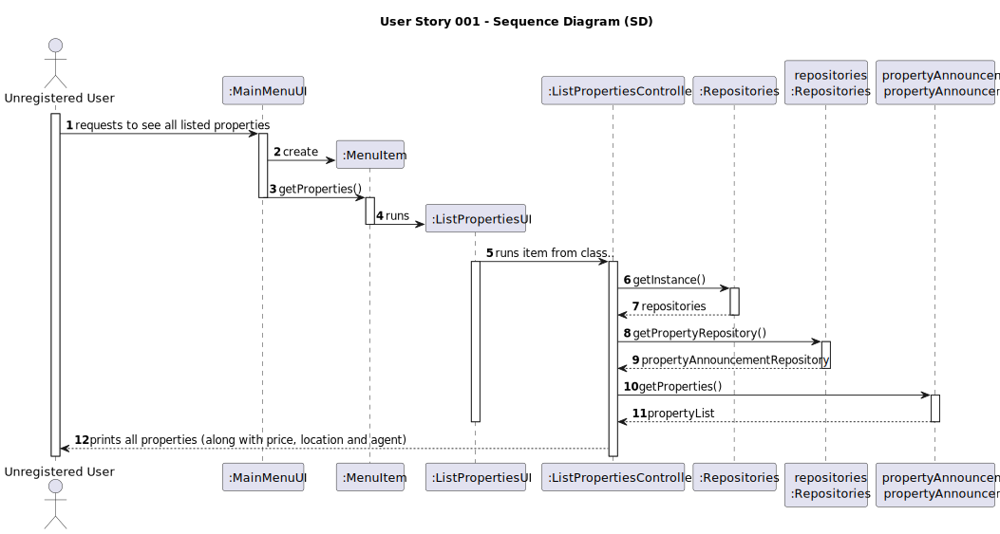
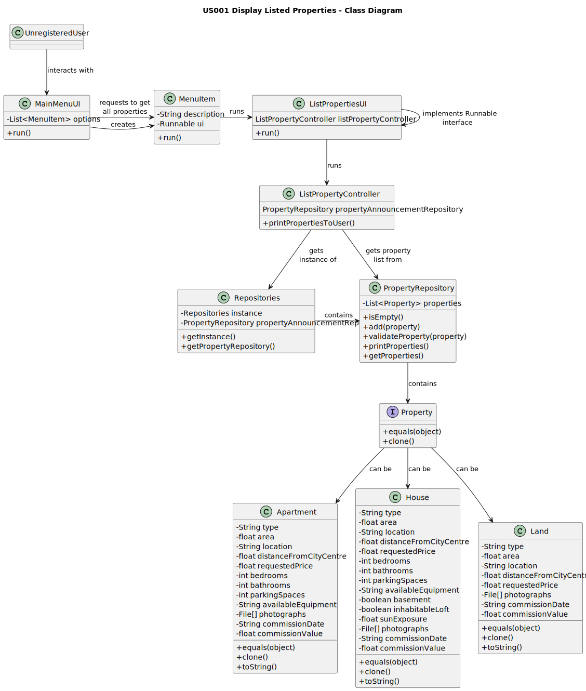

# US001 - Display Listed Properties

## 3. Design - User Story Realization

### 3.1. Rationale

**The rationale grounds on the SSD interactions and the identified input/output data.**

| Interaction ID | Question: Which class is responsible for...                    | Answer                   | Justification (with patterns)                                                   |
|:---------------|:---------------------------------------------------------------|:-------------------------|:--------------------------------------------------------------------------------|
| Step 1  		     | 		...requesting to see listed properties?					                 | Unregistered User        | The (Unregistered) User is the one that requests to list properties.            |
| Step 2  		     | 		...sending that request to the system?					                  | MainMenuUI               | The MainMenuUI is the bridge between the user and the system.                   |
| Step 3  		     | 		...getting a controller?					                                | ListPropertiesUI         | The ListPropertiesUI is the bridge between the User and the Controller.         |
| Step 4  		     | 		...getting the necessary information from repositories?					 | ListPropertiesController | The ListPropertiesController is the bridge between the UI and the Repositories. |
| Step 5  		     | 		...storing information about Properties?					                | PropertyRepository       | Repositories are responsible for storing information.                           |

### Systematization ##

According to the taken rationale, the conceptual classes promoted to software classes are:

* Unregistered User
* Property
* Land
* Apartment
* House

Other software classes (i.e. Pure Fabrication) identified:
* MainMenuUI
* MenuItem
* ListPropertiesUI
* ListPropertiesController
* PropertyRepository

## 3.2. Sequence Diagram (SD)

## 3.3. Class Diagram (CD)

