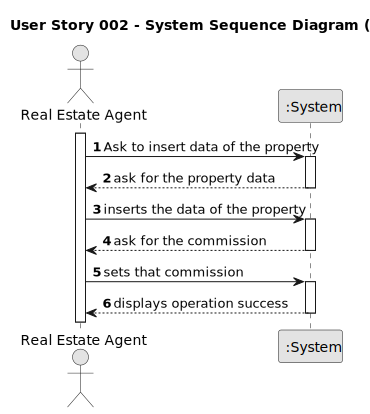

# US002 - Real Estate Agent

## 1. Requirements Engineering

### 1.1. User Story Description

As an agent, I can publish any sale announcement on the system, for
example received through a phone call.

### 1.2. Customer Specifications and Clarifications

**From the specifications document:**

> Upon receiving the client's order, the agents sets the commission and publishes the offer in the system.

**From the client clarifications:**

> **Question:** Are phone calls the only way an agent can receive sale announcements? Or can he receive them via e-mail/letter/etc
>
> **Answer**: For now this is the only way.

> **Question**: The act of publishing a sale announcement means that the agent is publishing a new property for sale in the system (receiving the information of the seller and publishing the new property for sale) or is it the buyer giving positive feedback to the agent with intent to buy the property(actually closing a sale, buying a property and de-listing said property)?
>
> **Answer**: In US1 we get "As an agent, I can publish any sale announcement on the system, for example received through a phone call". Additional information related with this question is also available in the project description. Asking the customer something that is clear or has already been clarified is unprofessional.

> **Question**: What would be the attributes of the Owner and Agent?
>
> **Answer**: The Owner attributes are: the name, the citizen's card number, the tax number, the address, the email address and the contact
telephone number. The Agent is an employee of the company.

> **Question**: When a sale order arrives at the agent, what are the acceptance criteria that he (the agent) uses to accept or reject the order? Is there a possibility for an agent to refuse due to a lack of data on the property's characteristics of a property given by the client? Or when the request arrives at the agent, are all the essential characteristics of the property in question already present?
>
> **Answer**: Yes. (refering to "[...] when the request arrives at the agent, are all the essential characteristics of the property in question already present?")

### 1.3. Acceptance Criteria

* **AC1:** Upon receiving the order, the agent sets the commission and publishes the offer in the system.

### 1.4. Found out Dependencies
The agent that the client will choose must be listed as an employee registered in the system (US003).
After consulting a list of properties, the client can request to schedule a visit to the real estate agent
for a specific property to verify its conditions. The agent receives the request, checks the
availability and sends the response. If the customer accepts the order, it is automatically scheduled
in the system.

### 1.5 Input and Output Data

**Input Data:**

* The option to set the commission and publish the offer in the system.

**Output Data:**

* (In)Success of the operation

### 1.6. System Sequence Diagram (SSD)

### 1.7 Other Relevant Remarks

n/a