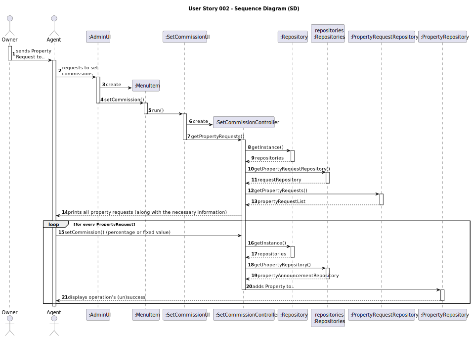
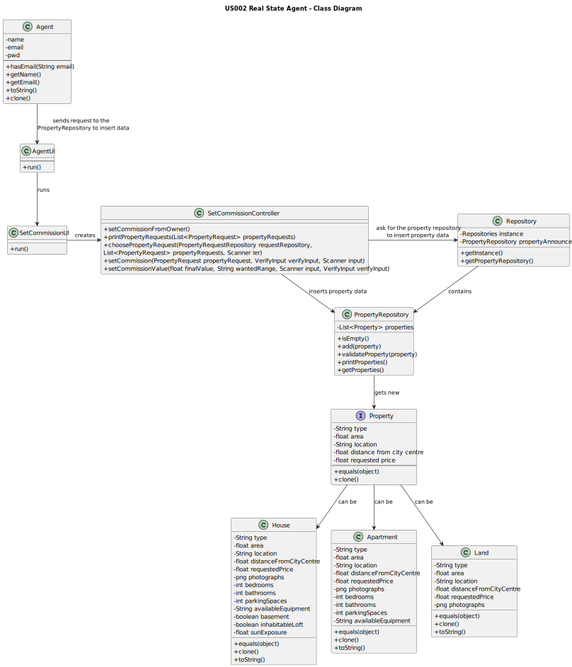

# US002 - Real State Agent

## 3. Design - User Story Realization

### 3.1. Rationale

**The rationale grounds on the SSD interactions and the identified input/output data.**

| Interaction ID | Question: Which class is responsible for...                                | Answer                    | Justification (with patterns)                                                                  |
|:-------------  |:---------------------------------------------------------------------------|:--------------------------|:-----------------------------------------------------------------------------------------------|
| Step 1  		 | ...setting commissions?                                                    | Agent                     | The agent is the one setting commissions from the client and publishing the sale in the system. |
| Step 2  		 | ...storing Property Requests?							                                       | PropertyRequestRepository | Just like other repositories, this one saves all the requests registered in the system.        |
| Step 3  		 | ...interacting with the agent?							                                      | SetCommissionUI           | The UI is the bridge between the User and the Controller.                                      |
| Step 4  		 | ...asking for the commission rate and registering the new Property?							 | SetCommissionController   | The Controller is the bridge between the UI and the Repositories.                              |
| Step 5  		 | ...storing the new Property in the system?							                          | PropertyRepository        | Just like other repositories, this one saves all the properties registered in the system.      |

### Systematization ##

According to the taken rationale, the conceptual classes promoted to software classes are:

* Agent
* Property
* PropertyRepository

Other software classes (i.e. Pure Fabrication) identified:
* AgentUI
* SetCommissionUI
* SetCommissionController

## 3.2. Sequence Diagram (SD)

## 3.3. Class Diagram (CD)

