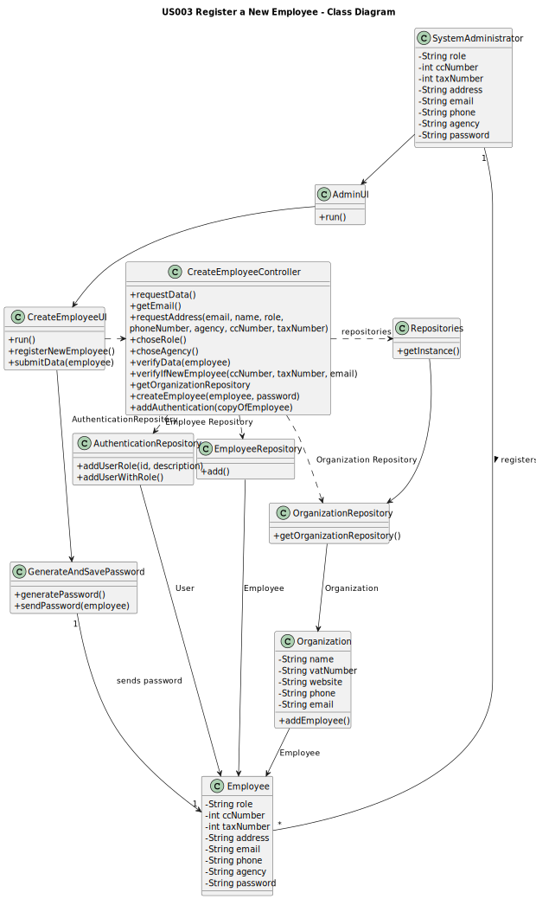

# US003 - Registering a new employee

## 3. Design - User Story Realization

### 3.1. Rationale

**The rationale grounds on the SSD interactions and the identified input/output data.**

| Interaction ID | Question: Which class is responsible for...       | Answer                   | Justification (with patterns)                                                                                   |
|:---------------|:--------------------------------------------------|:-------------------------|:----------------------------------------------------------------------------------------------------------------|
| Step 1  		     | ...asking to register a new employee?             | SystemAdministrator      | The administrator is the actor.                                                                                 |
| Step 2  		     | ...requesting data?                               | CrateEmployeeUI          | The UI is responsible for communicating with the user.                                                          |
| Step 3  		     | ...providing that data?                           | SystemAdministrator      | The administrator is responsible for providing the data they want to register.                                  |
| Step 4  		     | ...verifying data?                                | CreateEmployeeController | The Controller needs to verify the data before it gets stored. No employee should be registered more than once. |
| Step 5  		     | ...storing the data?	                             | CreateEmployeeRepository | The Repository is where all data pertaining to employees should be stored.                                      |
| Step 6  		     | ...generating 7 character password?               | GenerateAndSavePassword  | The password is part of the employee's registration process.                                                    |              
| Step 7  		     | ...sending that password to the employee's email? | GeneratedAndSavePassword | This class generated the password                                                                               |

### Systematization ##

According to the taken rationale, the conceptual classes promoted to software classes are:

* SystemAdministrator
* Employee
* 
Other software classes (i.e. Pure Fabrication) identified:
* AdminUI
* CreateEmployeeUI
* CreateEmployeeController
* EmployeeRepository
* GenerateAndSavePassword

## 3.2. Sequence Diagram (SD)

*In this section, it is suggested to present an UML dynamic view stating the sequence of domain related software objects' interactions that allows to fulfill the requirement.*

## 3.3. Class Diagram (CD)

*In this section, it is suggested to present an UML static view representing the main domain related software classes that are involved in fulfilling the requirement as well as and their relations, attributes and methods.*

