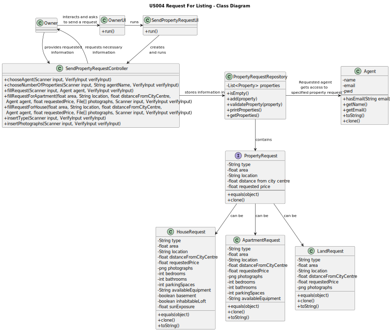

# US004 - Request for Listing

## 3. Design - User Story Realization

### 3.1. Rationale

**The rationale grounds on the SSD interactions and the identified input/output data.**

| Interaction ID | Question: Which class is responsible for...                     | Answer                        | Justification (with patterns)                                                                           |
|:---------------|:----------------------------------------------------------------|:------------------------------|:--------------------------------------------------------------------------------------------------------|
| Step 1  		     | 	...sending a Property Request to an Agent?						               | Owner                         | The Owner will be the one selling a property that they own.                                             |
| Step 2  		     | 	...interacting with the Owner?						                           | OwnerUI                       | The UI is the bridge between the User and the Controller.                                               |
| Step 3  		     | 	...asking the Owner about the details of their request?						  | SendPropertyRequestUI         | The UI is the bridge between the User and the Controller.                                               |
| Step 4  		     | 	...connecting the given information to the repositories?						 | SendPropertyRequestController | The Controller is the bridge between the UI and the Repositories.                                       |
| Step 5  		     | 	...storing the information given by the Owner?						           | PropertyRequest               | One object from this class will store one and only one request, along with its details.                 |
| Step 6  		     | 	...storing Property Requests?						                            | PropertyRequestRepository     | Repositories are responsible for storing objects of a certain class. This one stores Property Requests. |
| Step 7  		     | 	...receiving the Property Request?						                       | Agent                         | The Agent is the one that receives the commission and sets it (connects this US with US2)               |

### Systematization ##

According to the taken rationale, the conceptual classes promoted to software classes are:

* Owner
* Agent
* PropertyRequest

Other software classes (i.e. Pure Fabrication) identified:
* OwnerUI
* SendPropertyRequestUI
* SendPropertyRequestController

## 3.2. Sequence Diagram (SD)

## 3.3. Class Diagram (CD)

