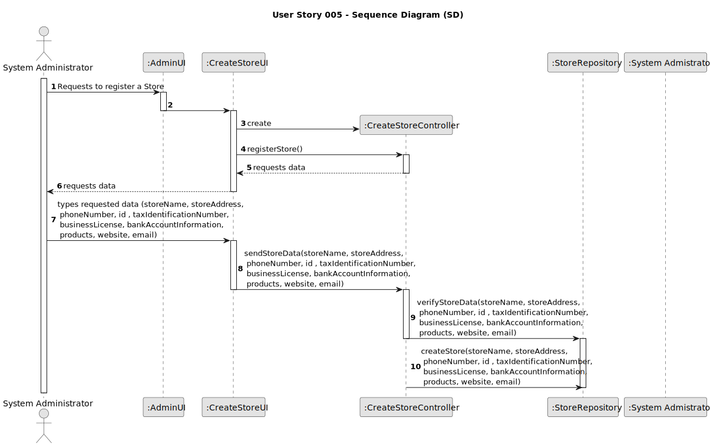
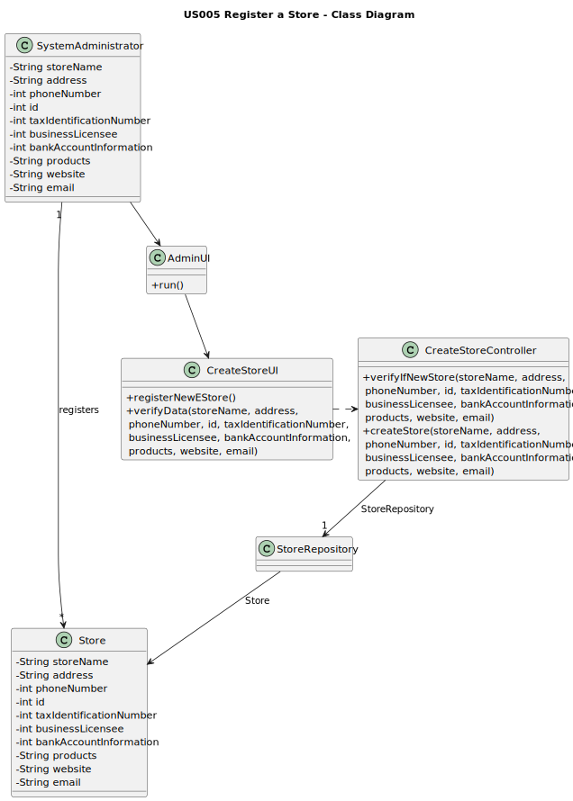

# US005 - Register a Store

## 3. Design - User Story Realization

### 3.1. Rationale

**The rationale grounds on the SSD interactions and the identified input/output data.**

| Interaction ID | Question: Which class is responsible for...       | Answer                   | Justification (with patterns)                                                                                |
|:-------------  |:--------------------------------------------------|:-------------------------|:-------------------------------------------------------------------------------------------------------------|
| Step 1  		     | ...asking to register a store?                    | SystemAdministrator      | The administrator is the actor.                                                                              |
| Step 2  		     | ...requesting data?                               | CrateStoreUI             | The UI is responsible for comunicating with the user.                                                        |
| Step 3  		     | ...providing that data?                           | SystemAdministrator      | The administrator is responsible for providing the data they want to register.                               |
| Step 4  		     | ...verifying data?                                | CreateStoreController    | The Controller needs to verify the data before it gets stored. No Store should be registered more than once. |
| Step 5  		     | ...storing the data?	                             | CreateStoreRepository    | The Repository is where all data pertaining to stores should be stored.                                      |

### Systematization ##

According to the taken rationale, the conceptual classes promoted to software classes are:

* SystemAdministrator
* Store

Other software classes (i.e. Pure Fabrication) identified:
* AdminUI
* CreateStoreUI
* CreateStoreController
* StoreRepository

## 3.2. Sequence Diagram (SD)

## 3.3. Class Diagram (CD)

