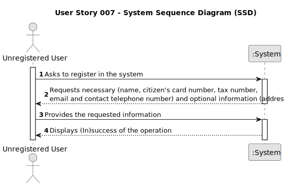

# US 007 -  Sign Up 

## 1. Requirements Engineering

### 1.1. User Story Description

As an unregistered user, I want to register in the system to buy, sell or rent properties.

### 1.2. Customer Specifications and Clarifications 

**From the specifications document:**

>	The user must provide their name, citizen's card number, tax number, address (optional), email address and contact telephone number and choose a password of 7 alphanumeric characters including 3 capital letters and 2 digits.

**From the client clarifications:**

> **Question:** Does the user also receive the password via email or can he choose a password when registering?
>  
> **Answer:** The Owner (?) can choose a password when registering.

> **Question:** When an unregistered user wants to register a new account in the system, the set of parameters that are asked are the following: name, citizen card number, tax number, email, phone number, and password. Do you want any extra parameters/requirements to be asked or just the ones specified above? If so, which ones are mandatory?
>  
> **Answer:** The Owner (?) attributes are: the name, the citizen's card number, the tax number, the address, the email address and the contact telephone number. The address of the client is not mandatory.

> **Question:** It was previously stated that an unregistered user could do a property listing request. However, with the introduction of US007, I want to clarify and make sure that now a user needs to be registered in order to buy, sell or rent properties, or if they can still do it unregistered.
> 
> **Answer:** In Sprint B we introduce US7 and now, in US4, the client needs to be registered in the system to submit a request for listing. You should update all artifacts to include this change.

### 1.3. Acceptance Criteria

* **AC1:** All required fields must be filled in (Except **Address**, which is optional).
* **AC2:** Password must have 7 alphanumeric characters with 3 capital letters and 2 digits.
* **AC3:** The System must verify if there is not already a registered user with the given information.

### 1.4. Found out Dependencies

* Every US (except for **US001**) needs the user to be logged in order to do their roles. 

### 1.5 Input and Output Data

**Input Data:**

* Typed data:
	* name
	* citizen's card number 
	* tax number
	* address (optional)
	* email address
	* contact telephone number

**Output Data:**

* (In)Success of the operation

### 1.6. System Sequence Diagram (SSD)

### 1.7 Other Relevant Remarks

The system must verify if the information given isn't already tied to a registered account.