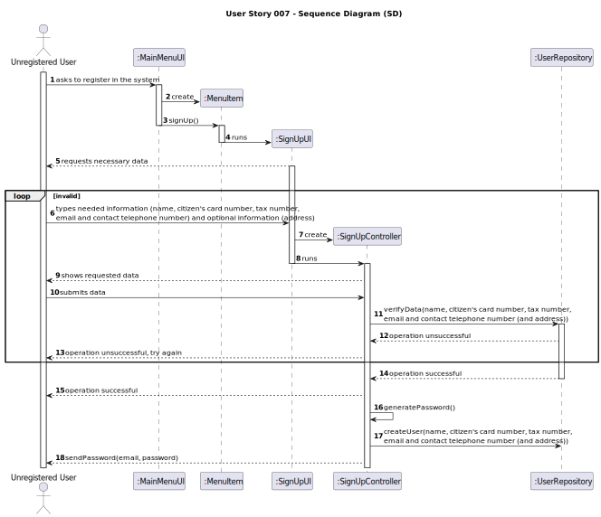
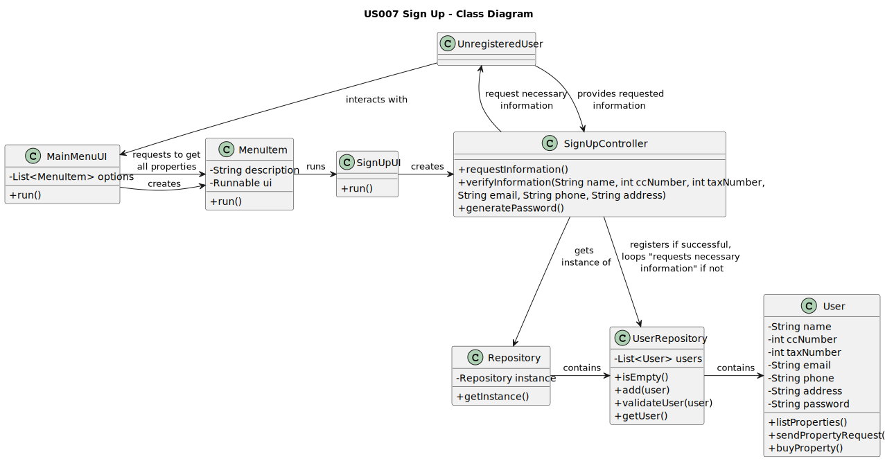

# US 007 - Sign Up 

## 3. Design - User Story Realization 

### 3.1. Rationale

| Interaction ID | Question: Which class is responsible for...                                        | Answer         | Justification (with patterns)                                                                                                                                                    |
|:---------------|:-----------------------------------------------------------------------------------|:---------------|:---------------------------------------------------------------------------------------------------------------------------------------------------------------------------------|
| Step 1  		     | 	...interacting with the actor?                                                    | MainMenuUI     | The MainMenuUI is the bridge between the user and the system.                                                                                                                    |
| Step 2		       | 	...giving the necessary instructions to the actor?                                | SignUpUI       | The SignUpUI will have the necessary instructions to give context to the user, as well as methods to deal with their possible responses.                                         |
| Step 3	  		    | 	...containing the UserRepository?                                                 | Repository     | The Repository contains every type of repository (Property, User, Employee, etc.).                                                                                               |
| Step 4	  		    | 	...containing information about the users?                                        | UserRepository | The UserRepository will contain all information regarding all users.                                                                                                             |
| Step 5	  		    | 	...verifying the given information?                                               | UserRepository | The UserRepository will: 1: Check if the information is valid; 2: Check if there isn't a user with that information already registered.                                  |
| Step 6	  		    | 	...generating a password and registering a user (if the operation is successful)? | SignUpUI       | The SignUpUI will loop its interactions with the user if the operation is unsuccessful, and will register the new user (and their new password) to the UserRepository otherwise. |

### Systematization ##

According to the taken rationale, the conceptual classes promoted to software classes are: 

 * UnregisteredUser
 * User

Other software classes (i.e. Pure Fabrication) identified: 

 * Repository
 * UserRepository
 * MainMenuUI
 * MenuItem
 * SignUpUI

## 3.2. Sequence Diagram (SD)

## 3.3. Class Diagram (CD)

