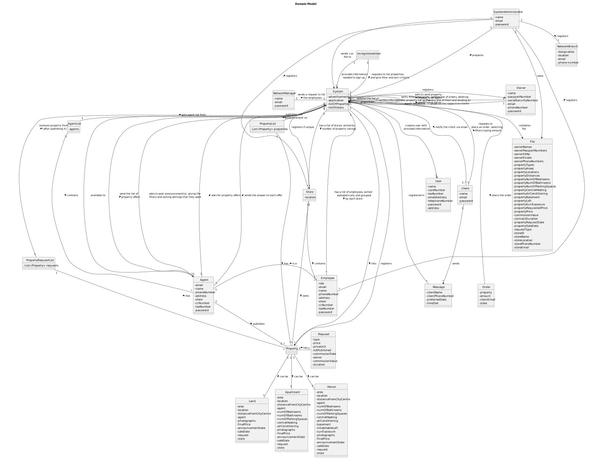

# OO Analysis #

## Rationale to identify domain conceptual classes ##

### _Conceptual Class Category List_ ###

**Business Transactions**

* Owner, Agent, Client

---

**Transaction Line Items**

* Property Announcements, Property Requests

---

**Product/Service related to a Transaction or Transaction Line Item**

* Property

---

**Transaction Records**

* System, Network Branch, System Administrator

---  

**Roles of People or Organizations**

* Client, System Administrator, Agent, Employee, Owner, Network Manager

---

**Places**

* Store, Property

---

**Noteworthy Events**

* System

---

**Physical Objects**

* Store, Property (Land, Apartment, House)

---

**Descriptions of Things**

* System, Request

---

**Catalogs**

* System  

---

**Containers**

* Repositories

---

**Elements of Containers**

*  User, Client, Employee, Agent, Property Requests, Property Announcements, Sold Properties

---

**Organizations**

* Store

---

**Other External/Collaborating Systems**

* System

---

**Records of finance, work, contracts, legal matters**

* System

---

**Financial Instruments**

* Property, System Administrator, System

---

**Documents mentioned/used to perform some work/**

* System, System Administrator
---

### **Rationale to identify associations between conceptual classes**

| Concept (A) 		           |                                      Association   	                                       |           Concept (B) |
|--------------------------|:------------------------------------------------------------------------------------------:|----------------------:|
| Unregistered User  	     |                           requests to list properties to    		 	                           |                System |
| Property List  	         |                                 contains multiple    		 	                                  |              Property |
| System  	                |                                       lists    		 	                                        |              Property |
| Property  	              |                                      contains    		 	                                      |               Request |
| Property  	              |                                       can be    		 	                                       |                  Land |
| Property  	              |                                       can be    		 	                                       |             Apartment |
| Property  	              |                                       can be    		 	                                       |                 House |
| Property Request List  	 |                                 contains multiple    		 	                                  |              Property |
| Agent  	                 |                           asks to post announcement(s) to   		 	                           |                System |
| Agent  	                 |                               publishes one or more    		 	                                |              Property |
| System  	                |                         updates the lists of properties on    		 	                         |                System |
| System  	                |                          removes property/properties from    		 	                          | Property Request List |
| System  	                |                          publishes property/properties on    		 	                          |         Property List |
| Agent  	                 |                                       is an    		 	                                        |              Employee |
| Store 	                  |                                 contains multiple    		 	                                  |              Employee |
| System Administrator 	   |                                     registers    		 	                                      |              Employee |
| Owner  	                 |                        asks to send property request(s) to    		 	                         |                System |
| System   	               |                                gets agent list from    		 	                                |            Agent List |
| Agent List   	           |                                 contains multiple    		 	                                  |                 Agent |
| System Administrator	    |                                     registers    		 	                                      |        Network Branch |
| System Administrator 	   |                                     registers    		 	                                      |                 Store |
| System Administrator  	  |                                      prepares    		 	                                      |                System |
| Unregistered User  	     |                         provides 'sign up' information to    		 	                          |                System |
| System   	               |                              verifies information on    		 	                               |                System |
| System   	               |                               creates new user with    		 	                                |                  User |
| System  	                |              sorts and filters the request list as the agent asked on    		 	              |                System |
| Client  	                |                                 sends one or more    		 	                                  |               Message |
| Message  	               |                                  is registered on    		 	                                  |                System |
| System  	                |                   makes the message available to the respective    		 	                    |                 Agent |
| Client  	                |                       requests to place one or more orders to   		 	                       |                System |
| System  	                |                                       places    		 	                                       |                 Order |
| Agent  	                 |                          asks for the property orders to    		 	                           |                System |
| System  	                |                         sends the property offers list to    		 	                          |                 Agent |
| Agent  	                 |                         sends the answer to each offer to    		 	                          |                System |
| System  	                | updates the list of offers, deleting every one that the agent accepted/declined on    		 	 |                System |
| System  	                |                                notifies via email     		 	                                 |                Client |
| System Administrator  	  |                                        owns    		 	                                        |                  File |
| System Administrator  	  |                                 sends .csv file to    		 	                                 |                System |
| System   	               |                                     validates     		 	                                     |                  File |
| System   	               |                               registers (if unique)    		 	                                |                 Owner |
| System   	               |                                     registers    		 	                                      |              Property |
| System   	               |                               registers (if unique)    		 	                                |                 Store |
| Network Manager   	      |                requests a list with all stores and all employees to    		 	                |                System |
| System   	               |                               has a sorted list of     		 	                                |                 Store |
| System   	               |                        has an alphabetically sorted list of    		 	                        |              Employee |
| Store   	                |                                        owns    		 	                                        |              Property |

## Domain Model

