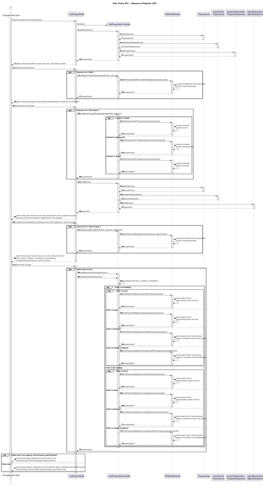
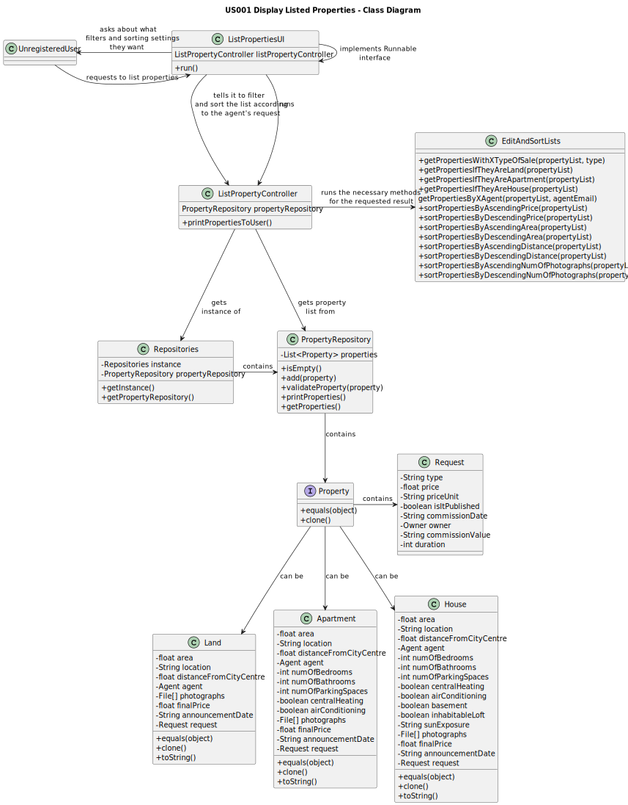

# US001 - Display Listed Properties

## 3. Design - User Story Realization

### 3.1. Rationale

**The rationale grounds on the SSD interactions and the identified input/output data.**

| Interaction ID | Question: Which class is responsible for...                                                           | Answer                         | Justification (with patterns)                                                                              |
|:---------------|:------------------------------------------------------------------------------------------------------|:-------------------------------|:-----------------------------------------------------------------------------------------------------------|
| Step 1  		     | ...asking to list properties?                                                                         | User                           | The user (registered or not) is the one requesting to list all properties.                                 |
| 		             | ...interacting with the user and creating a controller?                                               | ListPropertiesUI               | The UI will be the bridge between the user and the controller.                                             |
|                | ...getting an instance of Repositories?                                                               | ListPropertiesController       | The Controller is the bridge between the UI and the repositories.                                          |
| 		             | ...giving a copy of propertyAnnouncementRepository to the Controller?							                                      | Repositories                   | Repositories stores information about all kinds of repositories.                                           |
| 		             | ...giving a copy of the property list to the Controller?							                                       | PropertyAnnouncementRepository | The PropertyAnnouncementRepository stores a list of all properties on the system (and their requests).     |
| Step 2  		     | ...asking the user what type of request they want to see?							                                      | ListPropertiesUI               | The UI is responsible for interacting with the user.                                                       |
| Step 3  		     | ...answering the given question?							                                                               | User                           | The user is the one that chooses what type of requests they wants listed.                                  |
| 		             | ...calling the method that will filter what the user wanted?							                                   | ListPropertiesController       | The Controller is the bridge between the UI and the rest of the software.                                  |
| 		             | ...filtering the property list with the user's request?							                                        | EditAndSortLists               | EditAndSortLists will change a given list, filtering its items.                                            |
| Step 4  		     | ...asking the user what type of property they want to see?							                                     | ListPropertiesUI               | The UI is responsible for interacting with the user.                                                       |
| Step 5  		     | ...answering the given question?							                                                               | User                           | The user is the one that chooses what type of properties (land, apartment or house) they wants listed.     |
| 		             | ...calling the method that will filter what the user wanted?							                                   | ListPropertiesController       | The Controller is the bridge between the UI and the rest of the software.                                  |
| 		             | ...filtering the property list with the user's request?							                                        | EdistAndSortLists              | EditAndSortLists will change a given list, filtering its items.                                            |
| Step 6  		     | ...asking the user if they only want to see properties from a specific agent (listing agents)?							 | ListPropertiesUI               | The UI is responsible for interacting with the user.                                                       |
| 		             | ...giving a copy of agentRepository to the Controller?							                                         | Repositories                   | Repositories stores information about all kinds of repositories.                                           |
| 		             | ...giving a copy of the agent list to the Controller?							                                          | AgentRepository                | The AgentRepository stores a list of all agents on the system along with their data.                       |
| Step 7  		     | ...answering the given question, choosing an option?							                                           | User                           | The user is the one that chooses what agent they want to list properties from.                             |
| 		             | ...calling the method that will filter what the user wanted?							                                   | ListPropertiesController       | The Controller is the bridge between the UI and the rest of the software.                                  |
| 		             | ...filtering the property list with the user's request?							                                        | EditAndSortLists               | EditAndSortLists will change a given list, filtering its items.                                            |
| Step 8  		     | ...asking the user if they want to sort the list?							                                              | ListPropertiesUI               | The UI is responsible for interacting with the user.                                                       |
| Step 9  		     | ...answering the given question?							                                                               | User                           | The user is the one that chooses in what order they wants to see the list.                                 |
| 		             | ...calling the method that will sort as the user wanted?							                                       | ListPropertiesController       | The Controller is the bridge between the UI and the rest of the software.                                  |
| 		             | ...sorting the property list as the user requested?							                                            | EditAndSortLists               | EditAndSortLists will change a given list, sorting in ascending or descending order of a certain criteria. |
| Step 10  		    | ...sending a message to the user if there aren't any properties with the given filters?							        | ListPropertiesUI               | The UI is responsible for interacting with the user.                                                       |
| Step 11  		    | ...printing the list if there are properties with the given filters?							                           | ListPropertiesUI               | The UI is responsible for showing the list of properties to the user.                                      |

### Systematization ##

According to the taken rationale, the conceptual classes promoted to software classes are:

* Unregistered User
* Property
* Land
* Apartment
* House

Other software classes (i.e. Pure Fabrication) identified:
* ListPropertiesUI
* ListPropertiesController
* PropertyRepository

## 3.2. Sequence Diagram (SD)

## 3.3. Class Diagram (CD)

