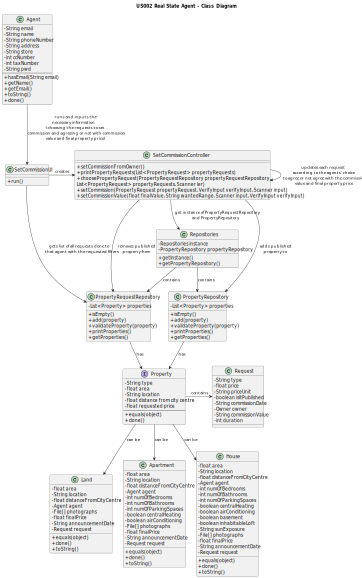

# US002 - Real State Agent

## 3. Design - User Story Realization

### 3.1. Rationale

**The rationale grounds on the SSD interactions and the identified input/output data.**

| Interaction ID | Question: Which class is responsible for...                                                    | Answer                    | Justification (with patterns)                                                                                      |
|:---------------|:-----------------------------------------------------------------------------------------------|:--------------------------|:-------------------------------------------------------------------------------------------------------------------|
| Step 1  		     | ...setting commissions?                                                                        | Agent                     | The agent is the one setting commissions from the client and publishing the sale in the system.                     |
| 		             | ...interacting with the user and creating a controller?                                        | SetCommissionUI           | The UI will be the bridge between the user and the controller.                                                     |
|                | ...getting an instance of Repositories?                                                        | SetCommissionController   | The Controller is the bridge between the UI and the repositories.                                                  |
| 		             | ...giving a copy of propertyAnnouncementRepository to the Controller?							                               | Repositories              | Repositories stores information about all kinds of repositories.                                                   |
| 		             | ...giving a copy of the property list to the Controller?							                                | PropertyRequestRepository | The PropertyRequestRepository stores a list of all property requests on the system.                                |
| Step 2  		     | ...asking the user what type of request they want to see?							                               | SetCommissionUI           | The UI is responsible for interacting with the user.                                                               |
| Step 3  		     | ...answering the given question?							                                                        | Agent                     | The user is the one that chooses what type of requests they wants listed.                                          |
| 		             | ...calling the method that will filter what the user wanted?							                            | SetCommissionController   | The Controller is the bridge between the UI and the rest of the software.                                          |
| 		             | ...filtering the property list with the user's request?							                                 | CreatePropertyList        | CreatePropertyList will change a given list, filtering its items.                                                  |
| Step 4  		     | ...asking the user what type of property they want to see?							                              | SetCommissionUI           | The UI is responsible for interacting with the user.                                                               |
| Step 5  		     | ...answering the given question?							                                                        | Agent                     | The user is the one that chooses what type of properties (land, apartment or house) they wants listed.             |
| 		             | ...calling the method that will filter what the user wanted?							                            | SetCommissionController   | The Controller is the bridge between the UI and the rest of the software.                                          |
| 		             | ...filtering the property list with the user's request?							                                 | CreatePropertyList        | CreatePropertyList will change a given list, filtering its items.                                                  |
| Step 6  		     | ...sending a message to the user if there aren't any properties with the given filters?							 | SetCommissionUI           | The UI is responsible for interacting with the user.                                                               |
| Step 7  		     | ...printing the list if there are properties with the given filters?							                    | SetCommissionUI           | The UI is responsible for showing the list of properties to the user.                                              |
| Step 8  		     | ...choosing a property request to set its commission?							                                   | Agent                     | The agent is the one setting commissions from the client and publishing the sale in the system.                     |
| Step 9  		     | ...asking the agent if there's an agreement on the current commission value?							            | SetCommissionUI           | The UI is responsible for interacting with the user.                                                               |
| Step 10  	     | ...answering the given question?							                                                        | Agent                     | The agent is the one responsible for keeping or changing the current commission value.                             |
| Step 11 		     | ...requesting the new commission value (in the % or fixed), if the answer was yes?							      | SetCommissionUI           | The UI is responsible for interacting with the user.                                                               |
| Step 12  	     | ...inserting the new commission value in a certain format?							                              | Agent                     | The agent is the one responsible for changing the commission value to the new value they discussed with the client. |
|   	            | ...updating the property with the new commission value?							                                 | SetCommissionController   | The Controller is responsible for updating the property as needed.                                                 |
| Step 13 		     | ...asking the agent if there's an agreement on the current property price?							              | SetCommissionUI           | The UI is responsible for interacting with the user.                                                               |
| Step 14  	     | ...answering the given question?							                                                        | Agent                     | The agent is the one responsible for keeping or changing the current property price.                               |
| Step 15 		     | ...requesting the new and final property price, if the answer was yes?							                  | SetCommissionUI           | The UI is responsible for interacting with the user.                                                               |
| Step 16  	     | ...inserting the final property price?							                                                  | Agent                     | The agent is the one responsible for changing the property price to the new value they discussed with the client.   |
|   	            | ...updating the property with the new property price?							                                   | SetCommissionController   | The Controller is responsible for updating the property as needed.                                                 |
| Step 17 		     | ...registering the new information?							                                                     | SetCommissionUI           | The UI is responsible for interacting with the rest of the system.                                                 |
|   	            | ...registering the sale announcement date?							                                              | SetCommissionController   | The Controller is responsible for updating the property as needed.                                                 |
|   	            | ...removing the already published property from PropertyRequestRepository?							              | SetCommissionController   | The Controller is the bridge between the UI and the rest of the software.                                                 |
|   	            | ...adding the published property to PropertyRepository?							                          | SetCommissionController   | The Controller is the bridge between the UI and the rest of the software.                                                 |
| Step 18 		     | ...displaying operation success to the user?							                                            | SetCommissionUI           | The UI is responsible for displaying information to the user.                                                      |

### Systematization ##

According to the taken rationale, the conceptual classes promoted to software classes are:

* Agent
* Property
* Repositories
* PropertyRepository
* PropertyRequestRepository
* CreatePropertyList

Other software classes (i.e. Pure Fabrication) identified:
* SetCommissionUI
* SetCommissionController

## 3.2. Sequence Diagram (SD)

## 3.3. Class Diagram (CD)

