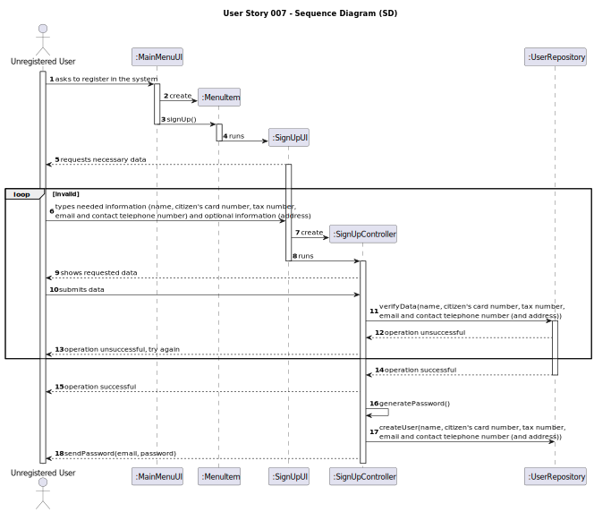
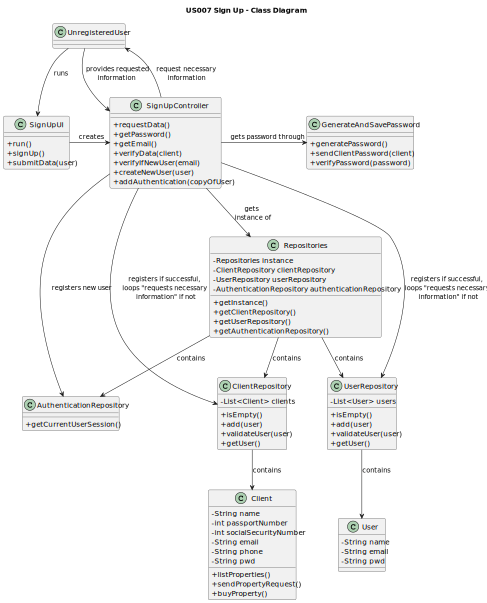

# US 007 - Sign Up 

## 3. Design - User Story Realization 

### 3.1. Rationale

| Interaction ID | Question: Which class is responsible for...              | Answer                  | Justification (with patterns)                                                                                                             |
|:---------------|:---------------------------------------------------------|:------------------------|:------------------------------------------------------------------------------------------------------------------------------------------|
| Step 1         | ...asking to register in the system?                     | Unregistered User       | The user is the actor.                                                                                                                    |
|                | ...creating the controller?                              | SignUpUI                | The UI connects the user to the controller.                                                                                               |
| Step 2         | ...requesting the necessary data?                        | SignUpUI                | The UI is responsible for communicating with the user.                                                                                    |
| Step 3         | ...providing that data?                                  | Unregistered User       | The user is the actor.                                                                                                                    |
| Step 4         | ...showing that data?                                    | SignUpUI                | The UI is responsible for communicating with the user.                                                                                    |
| Step 5         | ...submitting data?                                      | Unregistered User       | The user is the actor.                                                                                                                    |
|                | ...getting an instance of Repositories?                  | SignUpController        | The Controller connects the UI and the repositories.                                                                                      |
|                | ...getting a copy of clientRepository to the UI?         | Repositories            | Repositories stores information about all kinds of repositories.                                                                          |
|                | ...verifying the submitted data?                         | SignUpController        | The Controller connects the UI and the repositories. Therefore it should prevent unwanted data from being stored before it is registered. |
| Step 6         | ......displaying operation success?                      | SignUpUI                | The UI is responsible for communicating with the user.                                                                                    |
|                | ...getting an instance of Repositories?                  | SignUpController        | The Controller connects the UI and the repositories.                                                                                      |
|                | ...getting a copy of authenticationRepository to the UI? | Repositories            | Repositories stores information about all kinds of repositories.                                                                          |
|                | ...adding the user to the AuthenticationRepository?      | SignUpController        | The Controller connects the UI and the repositories.                                                                                      |
|                | ...adding the user to the ClientRepository?              | SignUpController        | The Controller connects the UI and the repositories.                                                                                      |
|                | ...storing the employee's password on a file?            | GenerateAndSavePassword | The GenerateAndSavePassword is responsible for making, storing and validating passwords.                                                  |

### Systematization ##

According to the taken rationale, the conceptual classes promoted to software classes are: 

 * Client

Other software classes (i.e. Pure Fabrication) identified: 

 * AuthenticationRepository
 * ClientRepository
 * SignUpUI
 * SignUpController
 * GenerateAndSavePassword

## 3.2. Sequence Diagram (SD)

## 3.3. Class Diagram (CD)

