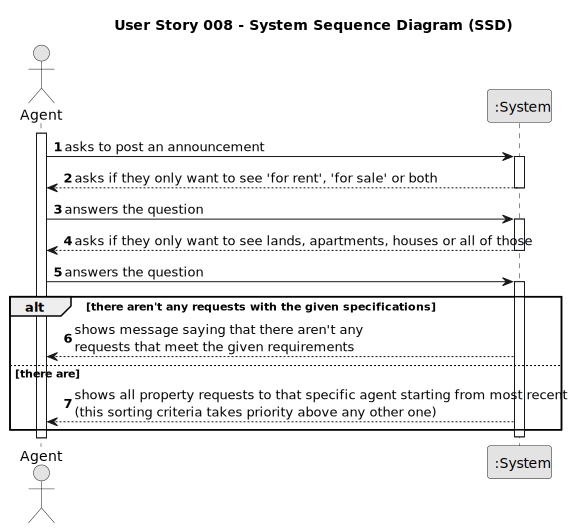

# US008 - List Property Announcement Requests

## 1. Requirements Engineering

### 1.1. User Story Description

As an agent, I intend to see the list of property announcement requests made to myself, so that I can post the announcement.

### 1.2. Customer Specifications and Clarifications

**From the specifications document:**

> The real estate agent reviews advertisement requests, registers the information in the system and publishes the offer so that it is visible to all clients who visit the agency and use the application. (Part of US002 is present here)

**From the client clarifications:**

> **Question**: Is the client responsible to assigning the property to an agent or there are other ways to do that?
> 
> **Answer**: In US8 we get "As an agent, I intend to see the list of property announcement requests made to myself, so that I can post the announcement". In this US the agent is the actor.

> **Question**: In this US8, will it be necessary to show search criteria? If so, which ones?
> 
> **Answer**: There is no search criteria.
 
> **Question**: Regarding US008, can the agent decline an announcement request?
> 
> **Answer**: Yes. The agent must include a message justifying the rejection.

> **Question**: Can the agent select multiple requests at the same time?
> 
> **Answer**: No. The agent can only post one announcement at a time.

> **Question**: When displaying the property announcement requests in the system to the agent besides them being ordered from most recent to oldest is there a need to display the specific day where the requests were published?
> 
> **Answer**: The list of property announcement requests should be sorted by the date they were created, with the most recent requests appearing first. The system should show the date when the property announcement requests was made.

> **Question**: It has been clearly previously established that there are two types of commissions (fixed and percentage). However, the CSV containing the data from the legacy system only has one column that references any type of commission: column U "commission(%)". Does that mean that there is only one type of commission, or was the fixed type accidentally left out or did I fail to notice the fixed commission type?
> 
> **Answer**: In the past our company only had the type of commissions that you see in the CSV file. Our legacy system has many limitations and this is why we are asking you to develop a new system.

> **Question**: In the CSV containing the data from the legacy system, properties classified as Apartment have themselves a value for Sun Exposure. However, the specification document describes this attribute as exclusive to the property type House: "In case the property is a house, the existence of a basement, an inhabitable loft, and sun exposure must be registered as well.". Do we add Sun Exposure to the apartment's attributes or does it stay exclusive to house?
> 
> **Answer**: When loading an apartment from the legacy system (from the CSV file) you should ignore the attribute Sun Exposure.
The CSV file contains data exported from a legacy system. The legacy system does not registers the same information that the system that you are developing now registers. For instance, the legacy system does not associates an agent to a property, therefore, when importing data from a legacy system you should create a agent/employee having:
name=Legacy Agent; passport card number=000000000; tax number=000000000, email address=legacy@realstateUSA.com; contact telephone number = 0000000000; and associate this "legacy agent" with each property (make it the property responsible agent). Moreover, you should prepare your system to accept two formats for the passport number, one with 9 numbers and the other starts with the letter C followed by eight numbers. 

### 1.3. Acceptance Criteria

* **AC1:** The list of property announcement requests should be sorted by the date they were created, with the most recent requests appearing first.
* **AC2:** An announcement is posted when a request is accepted. The list of requests should be refreshed, and that request should not be shown again.

### 1.4. Found out Dependencies

* The way the property announcement requests are listed influence US002 (The Agent has to choose from the listed properties) and is influenced by US004 (Different agents can't see the same property requests).

### 1.5 Input and Output Data

**Input Data:**

* Selected data:
  * All filter and sorting settings

**Output Data:**

* List of existing property requests (the most recent appearing first), giving the option to...
  * ...only see:
    * 'for sale', 'for rent' or both
    * lands, apartments, houses or all of them
  * ...sort by (ascending or descending):
    * price
    * area
    * number of photographs

* For each property request, list:
    * request (type of request, requested price, client's email and commission value and date)
    * area
    * location
    * distance from city centre
    * number of bedrooms*
    * number of bathrooms*
    * number of parking spaces*
    * description of available equipment*
    * existence of a basement**
    * existence of inhabitable loft**
    * direction of sun exposure (north, east, south or west)**
    * list of photographs

  
*for Apartments and Houses
    
**for Houses

### 1.6. System Sequence Diagram (SSD)

### 1.7 Other Relevant Remarks

The way the properties are listed on the website depends on the user's current machine (e.g. with a phone or a computer).