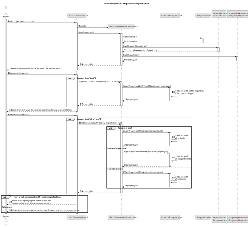
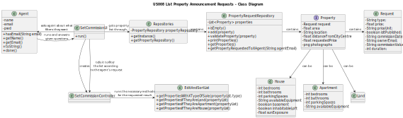

# US008 - List Property Announcement Requests

## 3. Design - User Story Realization

### 3.1. Rationale

**The rationale grounds on the SSD interactions and the identified input/output data.**

| Interaction ID | Question: Which class is responsible for...                                                    | Answer                  | Justification (with patterns)                                                                                |
|:---------------|:-----------------------------------------------------------------------------------------------|:------------------------|:-------------------------------------------------------------------------------------------------------------|
| Step 1  		     | ...setting commissions?                                                                        | Agent                   | The agent is the one setting commissions from the client and publishing the sale in the system.               |
| 		             | ...interacting with the agent and creating a controller?                                       | SetCommissionUI         | The UI will be the bridge between the user and the controller.                                               |
|                | ...getting an instance of Repositories?                                                        | SetCommissionController | The Controller is the bridge between the UI and the repositories.                                            |
| 		             | ...giving a copy of propertyAnnouncementRepository to the Controller?							                               | Repositories            | Repositories stores information about all kinds of repositories.                                             |
| 		             | ...giving a copy of the property list to the Controller?							                                | PropertyRepository      | The PropertyRepository stores a list of all properties on the system (and their requests).                   |
| Step 2  		     | ...asking the agent what type of request they want to see?							                              | SetCommissionUI         | The UI is responsible for interacting with the user.                                                         |
| Step 3  		     | ...answering the given question?							                                                        | Agent                   | The user is the one that chooses what type of requests he wants listed.                                      |
| 		             | ...calling the method that will filter what the user wanted?							                            | SetCommissionController | The Controller is the bridge between the UI and the rest of the software.                                    |
| 		             | ...filtering the property list with the user's request?							                                 | CreatePropertyList      | CreatePropertyList will change a given list, filtering its items.                                            |
| Step 4  		     | ...asking the agent what type of property they want to see?							                             | SetCommissionUI         | The UI is responsible for interacting with the user.                                                         |
| Step 5  		     | ...answering the given question?							                                                        | Agent                   | The user is the one that chooses what type of properties (land, apartment or house) he wants listed.         |
| 		             | ...calling the method that will filter what the user wanted?							                            | SetCommissionController | The Controller is the bridge between the UI and the rest of the software.                                    |
| 		             | ...filtering the property list with the user's request?							                                 | CreatePropertyList      | CreatePropertyList will change a given list, filtering its items.                                            |
| Step 6  		     | ...sending a message to the user if there aren't any properties with the given filters?							 | SetCommissionUI         | The UI is responsible for interacting with the user.                                                         |
| Step 7  		     | ...printing the list if there are properties with the given filters?							             | SetCommissionUI         | The UI is responsible for showing the list of properties to the user.                                        |

### Systematization ##

According to the taken rationale, the conceptual classes promoted to software classes are:

* Agent
* PropertyRepository
* CreatePropertyList

Other software classes (i.e. Pure Fabrication) identified:
* SetCommissionUI
* SetCommissionController

## 3.2. Sequence Diagram (SD)

## 3.3. Class Diagram (CD)

