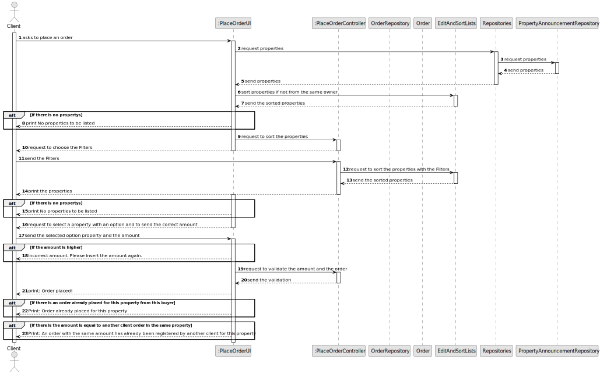
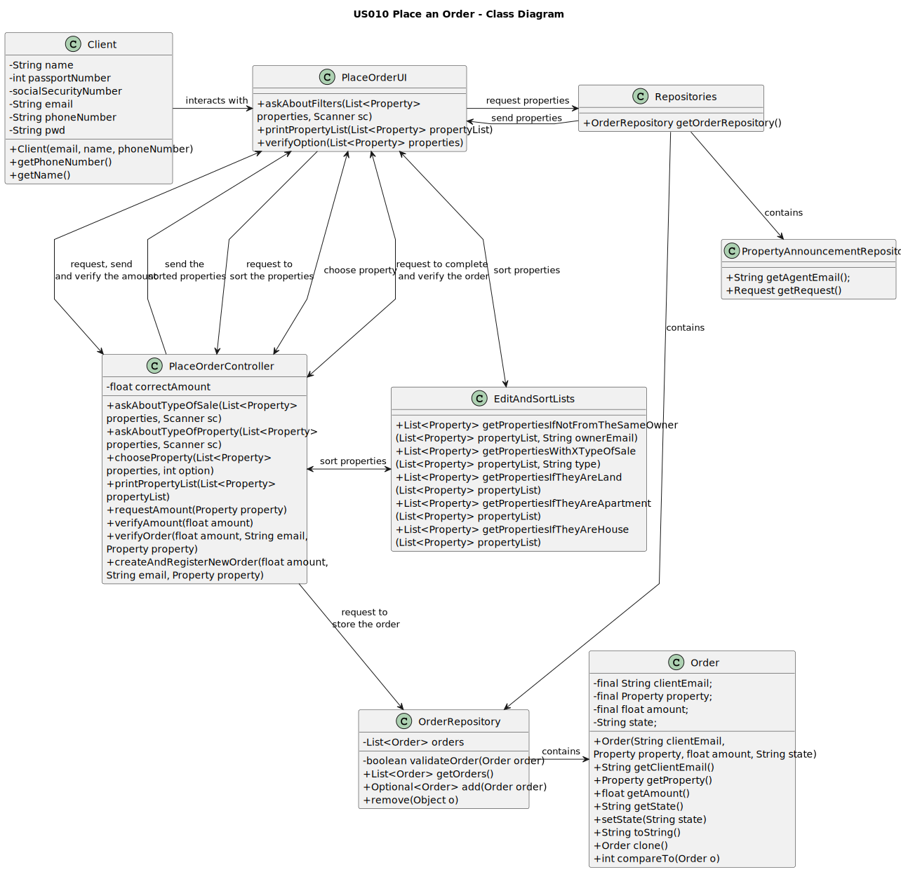

# US 010 - Place an Order

## 3. Design - User Story Realization

### 3.1. Rationale

| Interaction ID | Question: Which class is responsible for...                                                  | Answer               | Justification (with patterns)                                                                                   |
|:---------------|:---------------------------------------------------------------------------------------------|:---------------------|:----------------------------------------------------------------------------------------------------------------|
| Step 1  		     | 	...submitting an order to purchase a property?                                              | PlaceOrderUI         | 	Is the class responsible for interact with the Client.                                                         |
| Step 2			  		  | 	...checking if the order amount is equal to or lower than the property price?               | PlaceOrderController | The PlaceOrderController class is responsible for performing this validation                                    |
| Step 3			  		  | 	...checking if the order amount has already been posted for the property?                   | PlaceOrderController | The PlaceOrderController class class is responsible for checking if the order amount has already been posted.   |
| 		             | 	...stating that the order amount has been posted for the property on the screen?            | PlaceOrderUI         | 	The PlaceOrderUI class is responsible for displaying relevant information on the screen.                       |
| Step 4  		     | 	...considering the previously placed order when selling the property?                       | PlaceOrderController | The PlaceOrderController class is responsible for handling the priority of previously placed orders.            |
| Step 5  		     | 	..checking if the client can submit a new order for the same property?                      | PlaceOrderController | 	The PlaceOrderController class is responsible for checking if the client can submit a new order.               |
| Step 6  		     | 	...submitting a new order to purchase the same property after the previous one is declined? | PlaceOrderController | The PlaceOrderController class class is responsible for handling the submission of a new order after a decline. |

* Order
* OrderRepository

Other software classes (i.e. Pure Fabrication) identified:

* PlaceOrderUI
* PlaceOrderController

## 3.2. Sequence Diagram (SD)

## 3.3. Class Diagram (CD)

