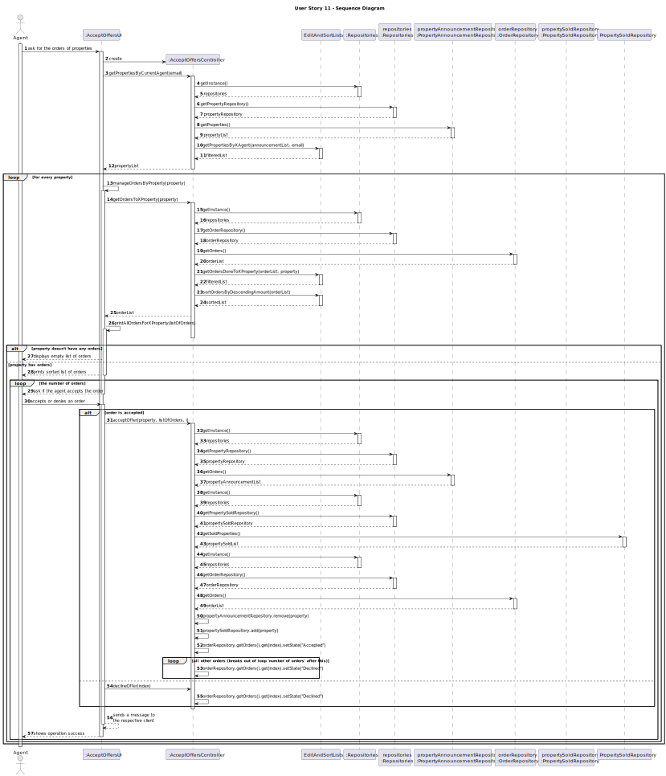

# US011 - Accept Offers

## 3. Design - User Story Realization

### 3.1. Rationale

**The rationale grounds on the SSD interactions and the identified input/output data.**

| Interaction ID | Question: Which class is responsible for...                                               | Answer                         | Justification (with patterns)                                                                          |
|:---------------|:------------------------------------------------------------------------------------------|:-------------------------------|:-------------------------------------------------------------------------------------------------------|
| Step 1  		     | ...asking to list property orders?                                                        | Agent                          | The agent is the one responsible for accepting orders.                                                 |
| 		             | ...creating a Controller?                                                                 | AcceptOffersUI                 | The UI is responsible for creating and managing their respective Controller.                           |
|                | ...getting an instance of Repositories?                                                   | ListPropertiesController       | The Controller is the bridge between the UI and the repositories.                                      |
| 		             | ...giving a copy of propertyAnnouncementRepository to the Controller?							              | Repositories                   | Repositories stores information about all kinds of repositories.                                       |
| 		             | ...giving a copy of the property list to the Controller?							                           | PropertyAnnouncementRepository | The PropertyAnnouncementRepository stores a list of all properties on the system (and their requests). |
| 		             | ...filtering the list with only the properties published by the current agent?							     | EditAndSortLists               | This class is responsible for editing various types of lists if needed.                                |
|                | ...getting an instance of Repositories?                                                   | ListPropertiesController       | The Controller is the bridge between the UI and the repositories.                                      |
| 		             | ...giving a copy of orderRepository to the Controller?							                             | Repositories                   | Repositories stores information about all kinds of repositories.                                       |
| 		             | ...giving a copy of the order list to the Controller?							                              | OrderRepository                | The OrderRepository stores a list of all orders on the system.                                         |
| 		             | ...filtering the list with only the orders made to that specific property?							         | EditAndSortLists               | This class is responsible for editing various types of lists if needed.                                |
| Step 2  		     | ...displaying an empty list of orders by each property if there aren't any?               | AcceptOffersUI                 | The UI will be responsible for delivering vital information to the user.                               |
| Step 3  		     | ...displaying a list of all orders by property if the lists are not empty?							         | AcceptOffersUI                 | The UI will be responsible for delivering vital information to the user.                               |
| Step 4  		     | ...asking if the agent accepts one order (each one is shown individually)?							         | AcceptOffersUI                 | The UI will be responsible for delivering vital information to the user.                               |
| Step 5  		     | ...accepting or denying the order?							                                                 | Agent                          | The agent is the one responsible for accepting orders.                                                 |
|                | ...getting an instance of Repositories?                                                   | ListPropertiesController       | The Controller is the bridge between the UI and the repositories.                                      |
| 		             | ...giving a copy of propertyAnnouncementRepository to the Controller?							              | Repositories                   | Repositories stores information about all kinds of repositories.                                       |
| 		             | ...giving a copy of the property list to the Controller?							                           | PropertyAnnouncementRepository | The PropertyAnnouncementRepository stores a list of all properties on the system (and their requests). |
|                | ...getting an instance of Repositories?                                                   | ListPropertiesController       | The Controller is the bridge between the UI and the repositories.                                      |
| 		             | ...giving a copy of propertySoldRepository to the Controller?							                      | Repositories                   | Repositories stores information about all kinds of repositories.                                       |
| 		             | ...giving a copy of the sold properties list to the Controller?							                    | PropertySoldRepository         | The PropertySoldRepository stores a list of all sold properties on the system (and their requests).    |
|                | ...getting an instance of Repositories?                                                   | ListPropertiesController       | The Controller is the bridge between the UI and the repositories.                                      |
| 		             | ...giving a copy of orderRepository to the Controller?							                             | Repositories                   | Repositories stores information about all kinds of repositories.                                       |
| 		             | ...giving a copy of the order list to the Controller?							                              | OrderRepository                | The OrderRepository stores a list of all orders on the system.                                         |
| 		             | ...updating the various lists depending on the order response?							                     | AcceptOffersController         | The Controller is responsible for managing the rest of the systems.                                    |
| Step 6  		     | ...automatically declining every other order on that property if one was accepted?							 | AcceptOffersController         | The Controller is responsible for managing the rest of the systems.                                    |
| Step 7  		     | ...sending a message to every client that had their offer(s) accepted/declined?							    | AcceptOffersController         | The Controller is responsible for managing the rest of the systems.                                    |
| Step 8  		     | ...displaying the operation success?							                                               | AcceptOffersUI                 | The UI will be responsible for delivering vital information to the user.                               |

### Systematization ##

According to the taken rationale, the conceptual classes promoted to software classes are:

* SystemAdministrator
* Property
* Land
* Apartment
* House
* Order

Other software classes (i.e. Pure Fabrication) identified:
* AcceptOffersUI
* AcceptOffersController

## 3.2. Sequence Diagram (SD)

## 3.3. Class Diagram (CD)

