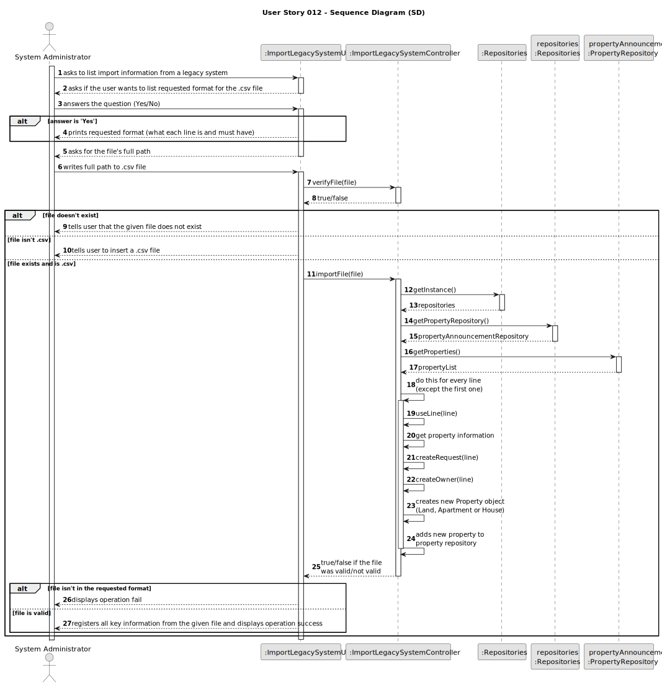
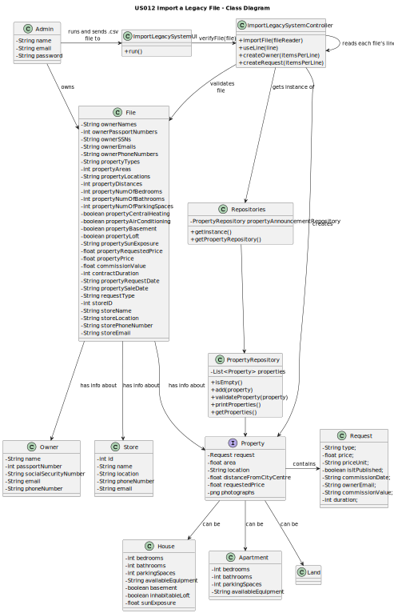

# US012 - Import a Legacy File

## 3. Design - User Story Realization

### 3.1. Rationale

**The rationale grounds on the SSD interactions and the identified input/output data.**

| Interaction ID | Question: Which class is responsible for...                                                            | Answer                       | Justification (with patterns)                                                                                                                                      |
|:---------------|:-------------------------------------------------------------------------------------------------------|:-----------------------------|:-------------------------------------------------------------------------------------------------------------------------------------------------------------------|
| Step 1  		     | ...importing information from legacy system?                                                           | System Administrator         | The Admin is the one managing and altering the system.                                                                                                             |
| Step 2		       | ...interacting with the System Administrator and asking them if they want to see the requested format? | ImportLegacySystemUI         | The UI is the way the program has to interact with the user.                                                                                                       |
| Step 3		       | ...answering the given question?							                                                                | System Administrator         | The user is the one that chooses if he wants to see the requested format or not.                                                                                   |
| Step 4		       | ...storing the requested format (and printing if the user answered 'Yes')?							                      | ImportLegacySystemUI         | The UI is the way the program has to show what it needs to the user.                                                                                               |
| Step 5  		     | ...asking for the file's full path?							                                                             | ImportLegacySystemUI         | The UI is the way the program has to interact and request things from the user.                                                                                    |
| Step 6  		     | ...providing the requested path to the file?							                                                    | System Administrator         | The user is the one that has access to the file containing information from the legacy system. Thus, they are the only one that can provide it to the new program. |
| 		             | ...creating the Controller?							                                                                     | ImportLegacySystemUI         | The UI is the bridge between the user and the Controller.                                                                                                          |
| 		             | ...verifying if the given file (from the user) exists and is a .csv file?							                       | ImportLegacySystemController | The Controller is the one responsible for analyzing the given information.                                                                                         |
| Step 7  		     | ...informing the user that the given file does not exist?							                                       | ImportLegacySystemUI         | The UI is responsible for giving information to the user.                                                                                                          |
| Step 8  		     | ...informing the user that the given file is not a .csv file?							                                   | ImportLegacySystemUI         | The UI is responsible for giving information to the user.                                                                                                          |
| 		             | ...performing the necessary operations to import the .csv file?							                                 | ImportLegacySystemController | The Controller is the bridge between the UI and the rest of the program.                                                                                           |
|                | ...getting an instance of Repositories?                                                                | ImportLegacySystemController | The Controller is the bridge between the UI and the repositories.                                                                                                  |
| 		             | ...giving a copy of propertyAnnouncementRepository to the Controller?							                                       | Repositories                 | Repositories stores information about all kinds of repositories.                                                                                                   |
| 		             | ...giving a copy of the property list to the Controller?							                                        | PropertyRepository           | The PropertyRepository stores a list of all properties on the system.                                                                                              |
| 		             | ...analyzing each line and adding its information to the given property repository?							             | ImportLegacySystemController | The Controller is responsible for performing the operations necessary to make the program function.                                                                |
| 		             | ...sending operation (un)success to the UI if the operation succeeds/fails at any point? 							       | ImportLegacySystemController | The Controller is the bridge between the UI and the rest of the program.                                                                                           |
| Step 9  		     | ...displaying operation fail if the Controller gave it a 'false' signal?							                        | ImportLegacySystemUI         | The UI is responsible for giving information to the user.                                                                                           |
| Step 10  		    | ...displaying operation success if the Controller gave it a 'true' signal?							                      | ImportLegacySystemUI         | The UI is responsible for giving information to the user.                                                                                           |

### Systematization ##

According to the taken rationale, the conceptual classes promoted to software classes are:

* SystemAdministrator
* PropertyRepository

Other software classes (i.e. Pure Fabrication) identified:
* ImportLegacySystemUI
* ImportLegacySystemController

## 3.2. Sequence Diagram (SD)

## 3.3. Class Diagram (CD)

