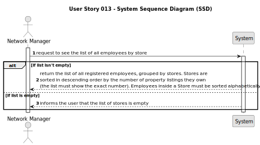

# US013 -  List Employees by Store
## 1. Requirements Engineering

### 1.1. User Story Description

As a network manager, I want to list all employees working in every store of the network.

### 1.2. Customer Specifications and Clarifications

**From the specifications document:**

> Each store in the network has a store manager and the set of stores is managed by a store network
manager. The main functions of a store manager are to monitor and streamline the branch with the
aim of getting to know better the business carried out and to analyse and evaluate the performance
of employees.

> The manager of the network intends to analyse the performance of each of the branches and the
global behaviour of the network on a daily basis.

**From the client clarifications:**

> **Question**: Do you want a list where the header is ID, the name of the store, and the total number of listings that the store has?
> 
> **Answer**: Yes.

> **Question**: And the alphabetical list of employees of that store repeated from the store with the most property listings to the one with the least property listings.
> 
> **Answer**: The answer to this question is to read carefully the acceptance criteria for this US and discuss them with your team...

### 1.3. Acceptance Criteria

* **AC1:** The list of employees should be alphabetically sorted and grouped by store. 
* **AC2:** Stores should be sorted according to their property listings, from the one with more listings to the one with less listings.
* **AC3:** Each store should state how many property listings it has.

### 1.4. Found out Dependencies

* In order to list Employees that work in every Store, we need to be able to:
  * Register a Store (US005)
  * Register an Employee (US003)

### 1.5 Input and Output Data

**Input Data:**

* The option to see where the employees are working.

**Output Data:**

* List of all the employees (employees are alphabetically sorted and grouped by store, each store is sorted from the one who has more listings to the one with less)
   

### 1.6. System Sequence Diagram (SSD)

### 1.7 Other Relevant Remarks

n/a