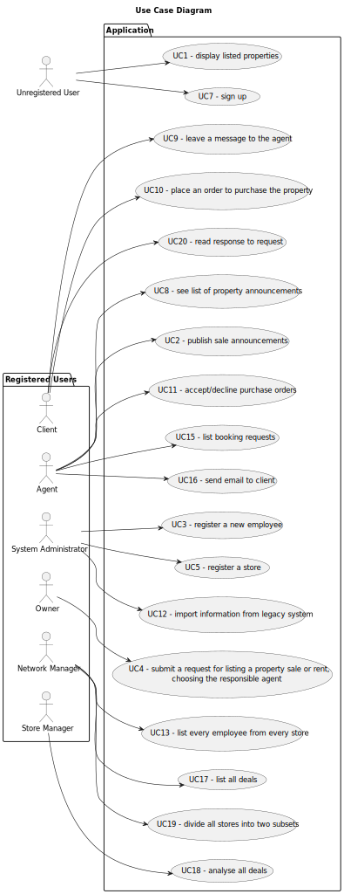

# Use Case Diagram (UCD)

# Use Cases / User Stories
| UC/US  | Description                                                  |                   
|:-------|:-------------------------------------------------------------|
| US 001 | [Display Listed Properties](../../us001/Readme.md)           |
| US 002 | [Real State Agent](../../us002/Readme.md)                    |
| US 003 | [Registering a new employee](../../us003/Readme.md)          |
| US 004 | [Request for Listing](../../us004/Readme.md)                 |
| US 005 | [Register a Store](../../us005/Readme.md)                    |
| US 007 | [Sign Up](../../us007/Readme.md)                             |
| US 008 | [List Property Announcement Requests](../../us008/Readme.md) |
| US 009 | [Leaving a Message](../../us009/Readme.md)                   |
| US 010 | [Place an order](../../us010/Readme.md)                      |
| US 011 | [Accept Offers](../../us011/Readme.md)                       |
| US 012 | [Import a Legacy File](../../us012/Readme.md)                |
| US 013 | [List all Employees](../../us013/Readme.md)                  |
| US 015 | [Listing all bookings](../../us015/Readme.md)                |
| US 016 | [Sending an Email Response](../../us016/Readme.md)           |
| US 017 | [List All Deals](../../us017/Readme.md)                      |
| US 018 | [Deal Analysis](../../us018/Readme.md)                       |
| US 019 | [Getting Close Subsets](../../us019/Readme.md)               |
| US 020 | [Read a Response](../../us020/Readme.md)                     |
