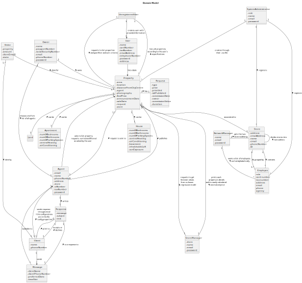

# OO Analysis #

## Rationale to identify domain conceptual classes ##

### _Conceptual Class Category List_ ###

**Business Transactions**

* Owner, Agent, Client

---

**Transaction Line Items**

* Property Announcements, Property Requests

---

**Product/Service related to a Transaction or Transaction Line Item**

* Property

---

**Transaction Records**

* System, Network Branch, System Administrator

---  

**Roles of People or Organizations**

* Client, System Administrator, Agent, Employee, Owner, Network Manager

---

**Places**

* Store, Property

---

**Noteworthy Events**

* System

---

**Physical Objects**

* Store, Property (Land, Apartment, House)

---

**Descriptions of Things**

* System, Request

---

**Catalogs**

* System  

---

**Containers**

* Repositories

---

**Elements of Containers**

*  User, Client, Employee, Agent, Property Requests, Property Announcements, Sold Properties

---

**Organizations**

* Store

---

**Other External/Collaborating Systems**

* System

---

**Records of finance, work, contracts, legal matters**

* System

---

**Financial Instruments**

* Property, System Administrator, System

---

**Documents mentioned/used to perform some work/**

* System, System Administrator
---

### **Rationale to identify associations between conceptual classes**

| Concept (A) 		           |                                       Association   	                                       |           Concept (B) |
|--------------------------|:-------------------------------------------------------------------------------------------:|----------------------:|
| UnregisteredUser  	   |            requests to list properties and give filter and sort criteria    		 	            |                  Property |
| Property  		       |             lists all properties according to the user's especifications    		              |                  UnregisteredUser |
| Property  		       |                                          has    		                                          |                  Request |
| Property  	           |                                       can be    		 	                                        |                  Apartment |
| Property  	           |                                       can be    		 	                                        |                  Land |
| Property  	           |                                       can be    		 	                                        |                  House |
| Agent  		             |                                       publishes    		                                       |                  Property |
| SystemAdministrator   |                                       registers    		                                       |                  Employee |
| Owner  		             |                          chooses one from list of all agents    		                          |                  Agent |
| Owner  		             |                                        owns    		 	                                         |                  Property |
| Property  	           |                                 request is sent to    		 	                                  |                  Agent |
| SystemAdministrator   |                                       registers    		                                       |                  Store |
| UnregisteredUser  	   |                        creates user with provided information    		                         |                  User |
| Agent  		             |       asks to list property requests, sorted and filtered as asked by the user    		        |                  Property |
| Client  		           |                                         sends    		                                         |                  Message |
| Message  		       |                                     available to    		                                      |                  Agent |
| Order  		             |                                        done by    		                                        |                  Client |
| Order  		             |                                       done for    		                                        |                  Property |
| SystemAdministrator   |                            creates through their .csv file    		                            |                  Property |
| Property  	           |                                    associated to    		 	                                    |                  Store |
| NetworkManager  	     |                   wants a list of employees, sorted alphabetically    		                    |                  Employee |
| Store  		             |                                       contains    		                                        |                  Employee |
| Employee  		         |                                      grouped by    		                                       |                  Store |
| Response  		         |                                   is a response to    		                                    |                  Message |
| Agent  		             |                                        writes    		                                         |                  Response |
| Agent  		             | sends response through email (the configurations are in the file 'config.properties')    		 |                  Client |
| User  		               |                                      lists deals    		                                      |                  Property |
| StoreManager  		     |            requests to get forecast values from a chosen regression model    		             |                  Property |
| Property  		       |        prints each property's details and its newly calculated estimated price    		        |                  StoreManager |
| Store  		             |                           divides stores into two sublists    		                            |                  Store |
| NetworkManager  	     |                              gets the two store sublists    		                              |                  Store |
| Response  		         |                                       print to    		                                        |                  Client |
| Client  		           |                                 accepts or declines    		                                  |                  Response |

## Domain Model

