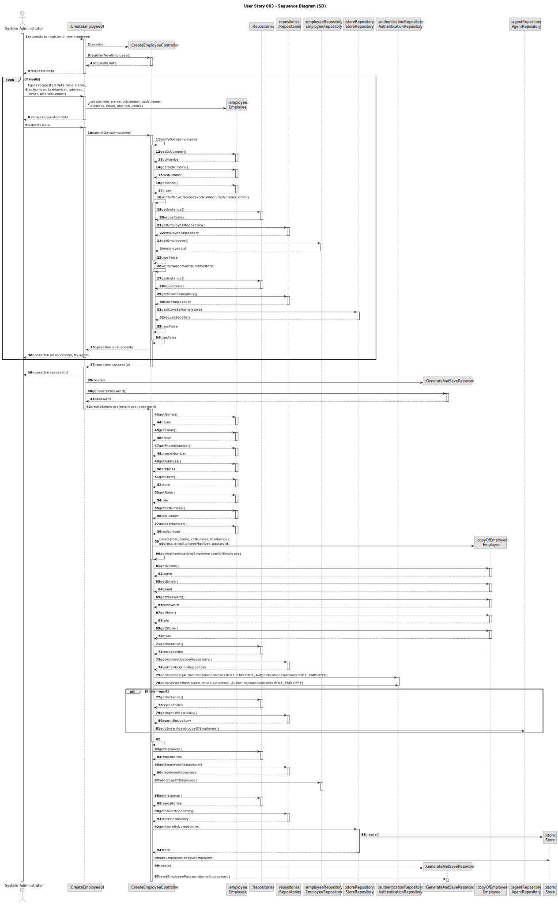
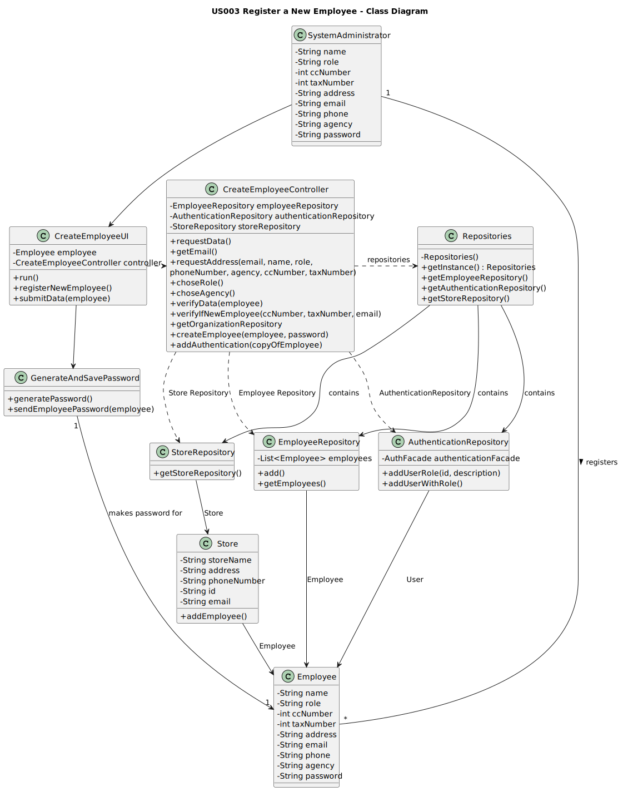

# US003 - Registering a new employee

## 3. Design - User Story Realization

### 3.1. Rationale

**The rationale grounds on the SSD interactions and the identified input/output data.**

| Interaction ID | Question: Which class is responsible for...                            | Answer                   | Justification (with patterns)                                                                                                                               |
|:---------------|:-----------------------------------------------------------------------|:-------------------------|:------------------------------------------------------------------------------------------------------------------------------------------------------------|
| Step 1         | ...requesting to register a new employee?                              | SystemAdministrator      | The administrator is the actor.                                                                                                                             |
|                | ...creating the controller?                                            | CreateEmployeeUI         | The UI connects the user to the controller.                                                                                                                 |
| Step 2         | ...requesting data?                                                    | CreateEmployeeUI         | The UI is responsible for communicating with the user.                                                                                                      |
| Step 3         | ...providing that data?                                                | SystemAdministrator      | The administrator is the actor.                                                                                                                             |
| Step 4         | ...showing that data?                                                  | CreateEmployeeUI         | The UI is responsible for communicating with the user.                                                                                                      |
| Step 5         | ...submitting that data?                                               | SystemAdministrator      | The administrator is the actor.                                                                                                                             |
|                | ...verifying that data?                                                | CreateEmployeeController | The Controller connects the UI and the repositories. Therefore it should prevent unwanted data from being stored before it is registered in the repository. |
|                | ...getting an instance of Repositories?                                | CreateEmployeeController | The Controller connects the UI and the repositories.                                                                                                        |
|                | ...getting a copy of employeeRepository to the UI?                     | Repositories             | Repositories stores information about all kinds of repositories.                                                                                            |
|                | ...giving a copy of the employee list to the UI?                       | EmployeeRepository       | The EmployeeRepository stores a list of all employees in the system.                                                                                        |
|                | ...getting an instance of Repositories?                                | CreateEmployeeController | The Controller connects the UI and the repositories.                                                                                                        |
|                | ...getting a copy of StoreRepository to the UI?                        | Repositories             | Repositories stores information about all kinds of repositories.                                                                                            |
|                | ...getting the agent's store(if the employee is an agent)?             | StoreRepository          | The StoreRepository stores a list of all store in the system.                                                                                               |
| Step 6         | ...displaying operation success?                                       | CreateEmployeeUI         | The UI is responsible for communicating with the user.                                                                                                      |              
|                | ...making a password for the employee?                                 | GenerateAndSavePassword  | The GenerateAndSavePassword is responsible for making, storing and validating passwords.                                                                    |
|                | ...adding the employee to the AuthenticationRepository?                | CreateEmployeeController | The Controller connects the UI and the repositories.                                                                                                        |
|                | ...getting an instance of Repositories?                                | CreateEmployeeController | The Controller connects the UI and the repositories.                                                                                                        |
|                | ...getting a copy of authenticationRepository to the UI?               | Repositories             | Repositories stores information about all kinds of repositories.                                                                                            |
|                | ...adding the employee to the EmployeeRepository?                      | CreateEmployeeController | The Controller connects the UI and the repositories.                                                                                                        |
|                | ...getting an instance of Repositories?                                | CreateEmployeeController | The Controller connects the UI and the repositories.                                                                                                        |
|                | ...getting a copy of agentRepository to the UI?                        | Repositories             | Repositories stores information about all kinds of repositories.                                                                                            |
|                | ...adding the employee to the AgentRepository (is they are and agent)? | CreateEmployeeController | The Controller connects the UI and the repositories.                                                                                                        |
|                | ...adding the employee to their store?                                 | CreateEmployeeController | The Controller is holding the employee's information, thanks to being responsible for connecting the UI and the repositories.                               |
|                | ...storing the employee's password on a file?                          | GenerateAndSavePassword  | The GenerateAndSavePassword is responsible for making, storing and validating passwords.                                                                    |

### Systematization ##

According to the taken rationale, the conceptual classes promoted to software classes are:

* SystemAdministrator
* Employee

Other software classes (i.e. Pure Fabrication) identified:

* CreateEmployeeUI
* CreateEmployeeController
* EmployeeRepository
* AuthenticationRepository
* StoreRepository
* AgentRepository
* GenerateAndSavePassword

## 3.2. Sequence Diagram (SD)

## 3.3. Class Diagram (CD)

