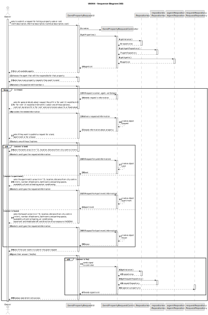
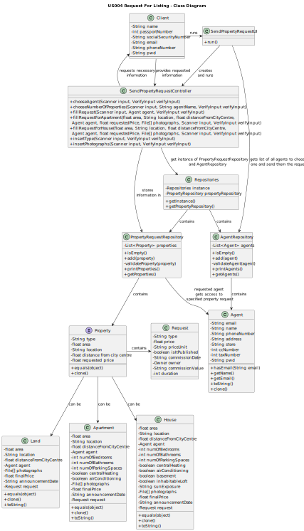

# US004 - Request for Listing

## 3. Design - User Story Realization

### 3.1. Rationale

**The rationale grounds on the SSD interactions and the identified input/output data.**

| Interaction ID | Question: Which class is responsible for...                                                      | Answer                        | Justification (with patterns)                                                                                                                                                                                            |
|:---------------|:-------------------------------------------------------------------------------------------------|:------------------------------|:-------------------------------------------------------------------------------------------------------------------------------------------------------------------------------------------------------------------------|
| Step 1  		     | 	...sending a Property Request to an Agent?						                                                | Client                        | The Owner is a Client that will sell a property that they own.                                                                                                                                                           |
| 		             | ...creating a controller?                                                                        | SendPropertyRequestUI         | The UI will be the bridge between the user and the controller.                                                                                                                                                           |
|                | ...getting an instance of Repositories?                                                          | SendPropertyRequestController | The Controller is the bridge between the UI and the repositories.                                                                                                                                                        |
| 		             | ...giving a copy of agentRepository to the Controller?							                                    | Repositories                  | Repositories stores information about all kinds of repositories.                                                                                                                                                         |
| 		             | ...giving a copy of the agent list to the Controller?							                                     | AgentRepository               | The AgentRepository stores a list of all agents on the system.                                                                                                                                                           |
| Step 2  		     | 	...listing all agents on the system to the Owner?						                                         | SendPropertyRequestUI         | The UI is the bridge between the User and the Controller.                                                                                                                                                                |
| Step 3  		     | 	...choosing the agent that will be responsible for the property?						                          | Client                        | The Owner will choose an Agent that will publish it later (US2).                                                                                                                                                         |
| Step 4  		     | 	...asking the owner how many requests they want to send to the chosen agent?						              | SendPropertyRequestUI         | The UI is the bridge between the User and the Controller.                                                                                                                                                                |
| Step 5  		     | 	...answering the question with a number?						                                                  | Client                        | The Owner will be sending x requests to the agent.                                                                                                                                                                       |
| 		             | 	...preparing to create a request?						                                                         | SendPropertyRequestController | The Controller is responsible for processing data for the UI.                                                                                                                                                            |
| Step 6  		     | 	...asking the general details about the request?						                                          | SendPropertyRequestUI         | The UI is the bridge between the User and the Controller.                                                                                                                                                                |
| Step 7  		     | 	...providing the requested information?						                                                   | Client                        | The Owner will be the one deciding details like the price or commission value.                                                                                                                                           |
| 		             | 	...creating a request with the given information?						                                         | SendPropertyRequestController | The Controller is responsible for processing data for the UI.                                                                                                                                                            |
| Step 8  		     | 	...asking if the Owner wants to request a land, apartment or house?						                       | SendPropertyRequestUI         | The UI is the bridge between the User and the Controller.                                                                                                                                                                |
| Step 9  		     | 	...answering the question selecting one of three options?						                                 | Client                        | The Owner is the one that knows the details about their property/properties. (Selecting 'Land' will use Steps 10 and 11, selecting 'Apartment' will use Steps 12 and 13, and selecting 'House' will use Steps 14 and 15) |
| Step 10  	     | 	...asking the details about the Owner's land?						                                             | SendPropertyRequestUI         | The UI is the bridge between the User and the Controller.                                                                                                                                                                |
| Step 11 		     | 	...providing the necessary details about their properties?						                                | Client                        | The Owner is the one that knows the details about their property/properties.                                                                                                                                             |
| 		             | 	...creating a land with all the data about the property?						                                  | SendPropertyRequestController | The Controller is responsible for processing data for the UI.                                                                                                                                                            |
| Step 12  	     | 	...asking the details about the Owner's apartment?						                                        | SendPropertyRequestUI         | The UI is the bridge between the User and the Controller.                                                                                                                                                                |
| Step 13 		     | 	...providing the necessary details about their properties?						                                | Client                        | The Owner is the one that knows the details about their property/properties.                                                                                                                                             |
| 		             | 	...creating an apartment with all the data about the property?						                            | SendPropertyRequestController | The Controller is responsible for processing data for the UI.                                                                                                                                                            |
| Step 14  	     | 	...asking the details about the Owner's house?						                                            | SendPropertyRequestUI         | The UI is the bridge between the User and the Controller.                                                                                                                                                                |
| Step 15 		     | 	...providing the necessary details about their properties?						                                | Client                        | The Owner is the one that knows the details about their property/properties.                                                                                                                                             |
| 		             | 	...creating a house with all the data about the property?						                                 | SendPropertyRequestController | The Controller is responsible for processing data for the UI.                                                                                                                                                            |
| Step 16 		     | 	...asking if the user wants to submit the given information?						                              | SendPropertyRequestUI         | The UI is the bridge between the User and the Controller.                                                                                                                                                                |
| Step 17 		     | 	...choosing to submit or not submit the information about their property/properties?						      | Client                        | The Owner is the one that decides if they want to upload, or if they want to cancel the request.                                                                                                                         |
| 		             | 	...preparing to add the new request to the system if the owner submitted the information?						 | SendPropertyRequestUI         | The UI is responsible for connecting the user with the rest of the system and information.                                                                                                                               |
|                | ...getting an instance of Repositories?                                                          | SendPropertyRequestController | The Controller is the bridge between the UI and the repositories.                                                                                                                                                        |
| 		             | ...giving a copy of requestRepository to the Controller?							                                  | Repositories                  | Repositories stores information about all kinds of repositories.                                                                                                                                                         |
| 		             | 	...adding the new request to the given request list?						                                      | SendPropertyRequestController | The Controller is responsible for processing data for the UI.                                                                                                                                                            |
| Step 18 		     | 	...displaying the success or failure of the operation to the user?						                        | SendPropertyRequestUI         | The UI is responsible for displaying information and data to the user.                                                                                                                                                   |

### Systematization ##

According to the taken rationale, the conceptual classes promoted to software classes are:

* Owner
* Agent
* Property

Other software classes (i.e. Pure Fabrication) identified:
* SendPropertyRequestUI
* SendPropertyRequestController

## 3.2. Sequence Diagram (SD)

## 3.3. Class Diagram (CD)

