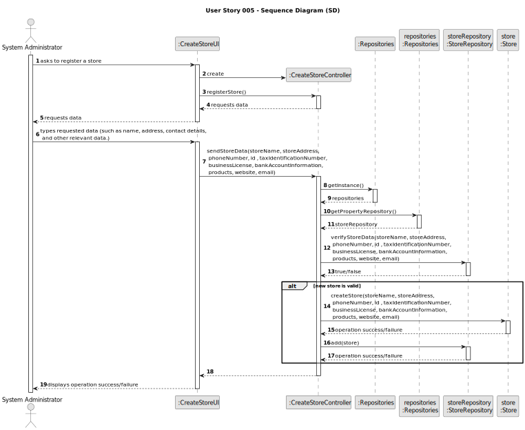
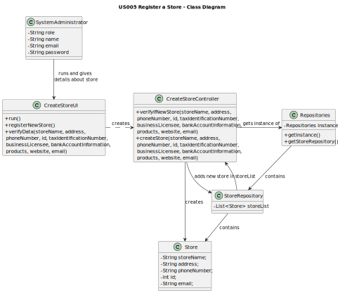

# US005 - Register a Store

## 3. Design - User Story Realization

### 3.1. Rationale

**The rationale grounds on the SSD interactions and the identified input/output data.**

| Interaction ID | Question: Which class is responsible for...                                      | Answer                | Justification (with patterns)                                     |
|:---------------|:---------------------------------------------------------------------------------|:----------------------|:------------------------------------------------------------------|
| Step 1  		     | ...asking to register a store?                                                   | SystemAdministrator   | The administrator is the actor.                                   |
| 		             | ...creating a controller?                                                        | CreateStoreUI         | A UI is responsible for creating its respective Controller.       |
| Step 2  		     | ...requesting data from user?                                                    | CreateStoreUI         | A UI is responsible for interacting with the user.                |
| Step 3  		     | ...typing the new store's data?                                                  | SystemAdministrator   | IE: knows store's data.                                           |
|                | ...getting an instance of Repositories?                                          | CreateStoreController | Controller                                                        |
| 		             | ...giving a copy of storeRepository to the Controller?	 	  					                 | Repositories          | Repositories stores information about all kinds of repositories.  |
| 		             | ...verifying if the new store's data already exists in the repository?	 	  					 | StoreRepository       | The Store Repository has information about all registered stores. |
| 		             | ...keeping the data about the store in a single object?	 	  					                | Store                 | The object 'Store' keeps information about a specific store.      |
| 		             | ...inserting the new store in the storeRepository?	 	  					                     | CreateStoreController | The Controller is responsible for processing data.                |
| Step 4		       | ...displaying operation success/failure to the user?	 	  					                   | CreateStoreUI         | A UI is responsible for interacting with the user.                |

### Systematization ##

According to the taken rationale, the conceptual classes promoted to software classes are:

* SystemAdministrator
* Store

Other software classes (i.e. Pure Fabrication) identified:
* CreateStoreUI
* CreateStoreController
* StoreRepository

## 3.2. Sequence Diagram (SD)

## 3.3. Class Diagram (CD)

