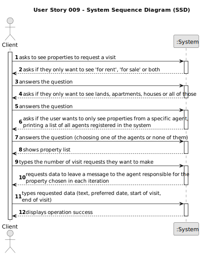

# US009 - Leaving a message

## 1. Requirements Engineering

### 1.1. User Story Description

As a client, I want to leave a message to the agent to schedule a visit to a
property of my interest.

### 1.2. Customer Specifications and Clarifications

**From the specifications document:**

After consulting a list of properties, the client can request to schedule a visit to the real estate agent
for a specific property to verify its conditions. The agent receives the request, checks the
availability and sends the response. If the customer accepts the order, it is automatically scheduled
in the system.

**From the client clarifications:**

>**Question**: US009's AC2 is "The message must also include the client's name, phone number, preferred date and time slot (from x hour to y hour) for the property visit.". Two of these, the name and phone number, are part of the client's data, which I assume is part of their registration process as a user. As such, these are my questions: 
>
> Does the client provide (by typing) their name and phone number for the message, regardless of whether or not that information is already available to the system?
>
>Is all the required data for the message typed, or is any of it selected?
>
>**Answer**: The information available in the system should be used. The client does not need to type the name and phone number.
> 
> For now the information should be typed.
 
>**Question**: In the message what is the characteristic to identify the property to visit? Can we use the location?
>
>**Answer**: The message should be associated with a property. Please check AC1. The client should select a property that he wants to visit before making the visit request.
 
>**Question**: When sending the message, is the visit immediately scheduled after being validated by the system, or is it necessary for the agent to approve it?
>
>**Answer**: No, the client is only making a visit request.

### 1.3. Acceptance Criteria

* **AC1:** A list of available properties must be shown, sorted from the most recent
  entries to the oldest.

* **AC2:** The message must also include the client's name, phone number,
  preferred date and time slot (from x hour to y hour) for the property visit.

* **AC3:** A client may post multiple visit requests, but only if those do not overlap
  each other.

* **AC4:** The client must receive a success message when the request is valid and
  registered in the system.

### 1.4. Found out Dependencies

The properties list must be shown to the client. Therefore, this US depends on the functionalities of US001.
Moreover, the client should be registered in the system, making this US dependant on the functionalities of US007.

### 1.5 Input and Output Data

**Input Data:**

* Typed data:
  * preferred date
  * time slot
  
* Selected data:
  * search filters
  * property

**Output Data:**
  * search filters
  * property list
  * data request
  * operation success

### 1.6. System Sequence Diagram (SSD)

### 1.7 Other Relevant Remarks
n/a
