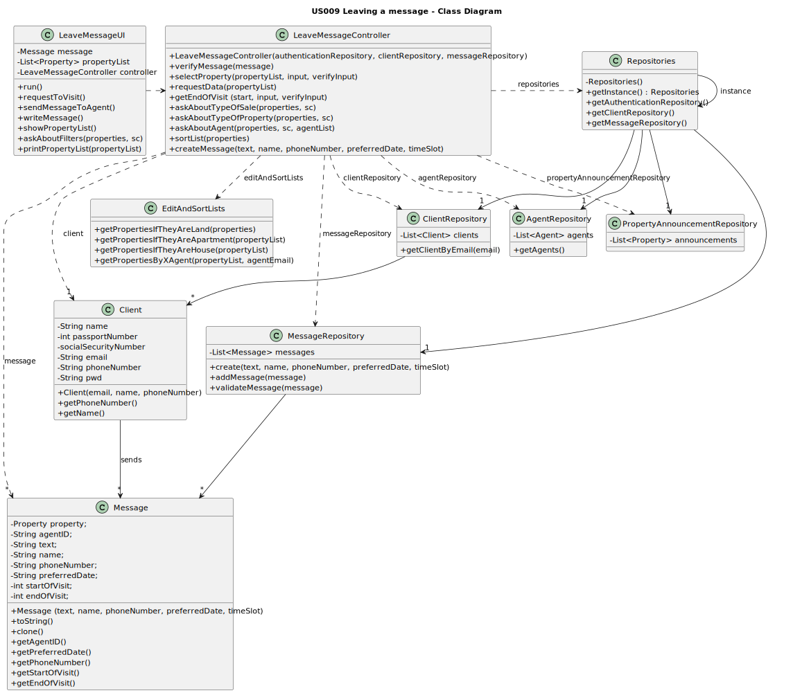

# US009 - Leaving a Message
## 3. Design - User Story Realization

### 3.1. Rationale

**The rationale grounds on the SSD interactions and the identified input/output data.**

| Interaction ID | Question: Which class is responsible for...                                                                                       | Answer                         | Justification (with patterns)                                                                                                                                                                                                        |
|:---------------|:----------------------------------------------------------------------------------------------------------------------------------|:-------------------------------|:-------------------------------------------------------------------------------------------------------------------------------------------------------------------------------------------------------------------------------------|
| Step 1         | ...requesting to visit properties?                                                                                                | Client                         | The client is the actor.                                                                                                                                                                                                             |
|                | ...creating the controller?                                                                                                       | LeaveMessageUI                 | The UI connects the user to the controller.                                                                                                                                                                                          |
|                | ...getting an instance of Repositories?                                                                                           | LeaveMessageUI                 | Generally, the Controller connects the UI and the repositories. However, for the purpose of getting the UI to have a property list attributed to it, just in this instance, the UI should be the one getting it from the Repository. |
|                | ...getting a copy of propertyAnnouncementRepository to the UI?                                                                    | Repositories                   | Repositories stores information about all kinds of repositories.                                                                                                                                                                     |
|                | ...giving a copy of the property list to the UI?                                                                                  | PropertyAnnouncementRepository | The PropertyAnnouncementRepository stores a list of all properties on the system (and their requests).                                                                                                                               |
| Step 2         | ...asking if they only want to see properties 'for rent', 'for sale' or for both?                                                 | LeaveMessageUI                 | The UI is responsible for communicating with the user.                                                                                                                                                                               |
| Step 3         | ...answering the question?                                                                                                        | Client                         | The client is the actor.                                                                                                                                                                                                             |
|                | ...calling the method that will filter what the user wanted?                                                                      | LeaveMessageController         | The Controller is the bridge between the UI and the rest of the software.                                                                                                                                                            |
|                | ...filtering the property list with the user's request?                                                                           | EditAndSortLists               | EditAndSortLists will change a given list, filtering its items.                                                                                                                                                                      |
| Step 4         | ...asking if they only want to see lands, apartments, houses or all of those?                                                     | LeaveMessageUI                 | The UI is responsible for communicating with the user.                                                                                                                                                                               |
| Step 5         | ...answering the question?                                                                                                        | Client                         | The client is the actor.                                                                                                                                                                                                             |
|                | ...calling the method that will filter what the user wanted?                                                                      | LeaveMessageController         | The Controller is the bridge between the UI and the rest of the software.                                                                                                                                                            |
|                | ...filtering the property list with the user's request?                                                                           | EditAndSortLists               | EditAndSortLists will change a given list, filtering its items.                                                                                                                                                                      |
| Step 6         | ...asking if the user wants to only see properties from a specific agent, printing a list of all agents registered in the system? | LeaveMessageUI                 | The UI is responsible for communicating with the user.                                                                                                                                                                               |              
|                | ...getting an instance of Repositories?                                                                                           | LeaveMessageController         | The Controller connects the UI and the repositories.                                                                                                                                                                                 |
|                | ...giving a copy of agentRepository to the Controller?                                                                            | Repositories                   | Repositories stores information about all kinds of repositories.                                                                                                                                                                     |
|                | ...giving a copy of the agent list to the Controller?                                                                             | AgentRepository                | The AgentRepository stores a list of all agents on the system along with their data.                                                                                                                                                 |
| Step 7         | ...answering the question?                                                                                                        | Client                         | The client is the actor.                                                                                                                                                                                                             |
|                | ...calling the method that will filter what the user wanted?                                                                      | LeaveMessageController         | The Controller is the bridge between the UI and the rest of the software.                                                                                                                                                            |
|                | ...filtering the property list with the user's request?                                                                           | EditAndSortLists               | EditAndSortLists will change a given list, filtering its items.                                                                                                                                                                      |
| Step 8         | ...displaying the property list?                                                                                                  | LeaveMessageUI                 | The UI is responsible for communicating with the user.                                                                                                                                                                               |
| Step 9         | ...typing the number of visit requests they want to make?                                                                         | Client                         | The client is the actor.                                                                                                                                                                                                             |
| Step 10        | ...requesting data to leave a message to the agent responsible for the property chosen in each iteration?                         | LeaveMessageUI                 | The UI is responsible for communicating with the user.                                                                                                                                                                               |
|                | ...getting an instance of Repositories?                                                                                           | LeaveMessageController         | The Controller connects the UI and the repositories.                                                                                                                                                                                 |
|                | ...getting a copy of authenticationRepository to the UI?                                                                          | Repositories                   | Repositories stores information about all kinds of repositories.                                                                                                                                                                     |
|                | ...getting a copy of authenticationFacade to the UI?                                                                              | AuthenticationRepository       | The AuthenticationRepository stores the AuthenticationFacade.                                                                                                                                                                        |
|                | ...getting a copy of the current userSession to the UI?                                                                           | AuthenticationFacade           | The AuthenticationFacade stores the current UserSession.                                                                                                                                                                             |
|                | ...getting a copy of the user's ID to the UI?                                                                                     | UserSession                    | The UserSession stores the userID.                                                                                                                                                                                                   |
|                | ...getting an instance of Repositories?                                                                                           | LeaveMessageController         | The Controller connects the UI and the repositories.                                                                                                                                                                                 |
|                | ...getting a copy of clientRepository to the UI?                                                                                  | Repositories                   | Repositories stores information about all kinds of repositories.                                                                                                                                                                     |
|                | ...getting the client's name?                                                                                                     | Client                         | The client class stores its own data.                                                                                                                                                                                                |
|                | ...getting the client's phone number?                                                                                             | Client                         | The client class stores its own data.                                                                                                                                                                                                |
|                | ...getting the agent's email?                                                                                                     | Property                       | The property has been assigned and agent, therefore it stores that data within it.                                                                                                                                                   |
|                | ...getting an instance of Repositories?                                                                                           | LeaveMessageController         | The Controller connects the UI and the repositories.                                                                                                                                                                                 |
|                | ...getting a copy of messageRepository to the UI?                                                                                 | Repositories                   | Repositories stores information about all kinds of repositories.                                                                                                                                                                     |
| Step 11        | ...typing requested data?                                                                                                         | Client                         | The client is the actor.                                                                                                                                                                                                             |
|                | ...validating the message's data?                                                                                                 | MessageRepository              | Being responsible for storing the message, also means it is responsible for making sure it is valid before registering information. Storing wrong data isn't a good practice, or just desirable in general.                          |
|                | ...registering the data?                                                                                                          | MessageRepository              | This is the main purpose of this class.                                                                                                                                                                                              |
| Step 12        | ...displaying operation success?                                                                                                  | LeaveMessageUI                 | The UI is responsible for communicating with the user.                                                                                                                                                                               |

### Systematization ##

According to the taken rationale, the conceptual classes promoted to software classes are:

* Client

Other software classes (i.e. Pure Fabrication) identified:
* LeaveMessageUI
* LeaveMessageController
* AuthenticationRepository
* ClientRepository
* PropertyAnnouncementRepository
* CreatePropertyList
* AgentRepository

## 3.2. Sequence Diagram (SD)

## 3.3. Class Diagram (CD)

