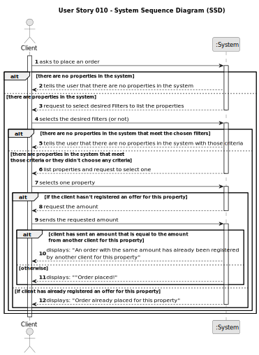

# US 010 - Place an order

## 1. Requirements Engineering

### 1.1. User Story Description

As a client, I want to place an order to purchase a property, submitting the order amount.

### 1.2. Customer Specifications and Clarifications

**From the specifications document:**

>	Each task is characterized by having a unique reference per organization, a designation, an informal and a technical description, an estimated duration and cost as well as the its classifying task category.

>	As long as it is not published, access to the task is exclusive to the employees of the respective organization.

**From the client clarifications:**

> **Question:** Which is the unit of measurement used to estimate duration?
>
> **Answer:** Duration is estimated in days.

> **Question:** Monetary data is expressed in any particular currency?
>
> **Answer:** Monetary data (e.g. estimated cost of a task) is indicated in POTs (virtual currency internal to the platform).

### 1.3. Acceptance Criteria

* **AC1:** The order amount submitted by the client must be equal to or lower than the price set by the client for the property.
* **AC2:** If the order amount submitted by the client has already been posted for the property (by another request from this client or any other client), the system must state that on the screen and the order placed previously should be considered first when selling the property
* **AC3:** A client can only submit a new order to purchase the same property after the previous one is declined.

### 1.4. Found out Dependencies

* There is a dependency to "US001 Display Listed Properties" since the client needs to have access to the list of properties that are available for purchase.

### 1.5 Input and Output Data

* Input Data:
    * Property details 
    * Client details 
    * Order amount

* Typed data:
    * Property details: Structured data 
    * Client details: Structured data 
    * Order amount

* Selected data:
    * Property price
    * Previous order amounts

**Output Data:**
* (In)Success of the operation

### 1.6. System Sequence Diagram (SSD)

### 1.7 Other Relevant Remarks

n\a 