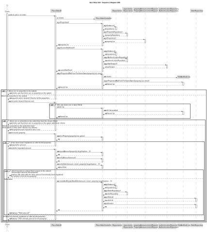
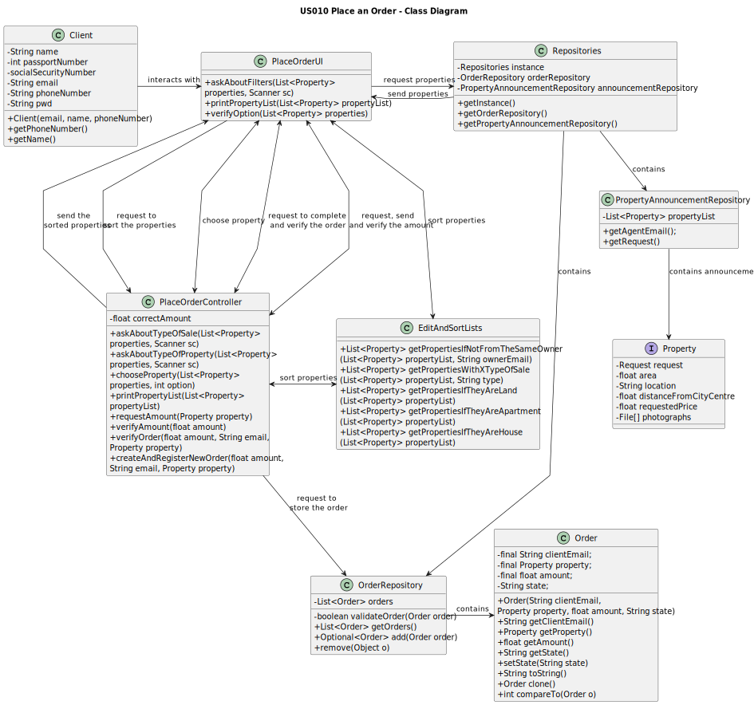

# US 010 - Place an Order

## 3. Design - User Story Realization

### 3.1. Rationale

| Interaction ID | Question: Which class is responsible for...                                                                                   | Answer                         | Justification (with patterns)                                                                          |
|:---------------|:------------------------------------------------------------------------------------------------------------------------------|:-------------------------------|:-------------------------------------------------------------------------------------------------------|
| Step 1  		     | 	...asking to place an order to purchase a property?                                                                          | Client                         | The Client is the one interested in properties.                                                        |
| 		             | ...interacting with the user and creating a controller?                                                                       | PlaceOrderUI                   | The UI will be the bridge between the user and the controller.                                         |
|                | ...getting an instance of Repositories?                                                                                       | PlaceOrderController           | The Controller is the bridge between the UI and the repositories.                                      |
| 		             | ...giving a copy of propertyAnnouncementRepository to the Controller?							                                                  | Repositories                   | Repositories stores information about all kinds of repositories.                                       |
| 		             | ...giving a copy of the property list to the Controller?							                                                               | PropertyAnnouncementRepository | The PropertyAnnouncementRepository stores a list of all properties on the system (and their requests). |
| 		             | ...giving a copy of authenticationRepository to the Controller?							                                                        | Repositories                   | Repositories stores information about all kinds of repositories.                                       |
| 		             | ...giving a copy of the current user email to the Controller?							                                                          | AuthenticationRepository       | The AuthenticationRepository is responsible for storing the user login information.                    |
| 		             | ...creating an object to filter the list?							                                                                              | ListPropertiesController       | The Controller is the bridge between the UI and the repositories.                                      |
| 		             | ...only delivering properties that aren't from the current user?							                                                       | EditAndSortLists               | This class is responsible for filtering and sorting lists.                                             |
| Step 2  		     | 	...telling the user that there aren't any properties (if there aren't any)?                                                  | PlaceOrderUI                   | The UI is responsible for interacting with the Client.                                                 |
| Step 3  		     | 	...telling the user that there are properties (if there are any registered in the system), requesting filters?               | PlaceOrderUI                   | The UI is responsible for interacting with the Client.                                                 |
| Step 4  		     | 	...selecting a filter to the list of properties (or not)?                                                                    | Client                         | The Client is the one that knows what type of properties they want to see.                             |
| 		             | ...filtering the list as asked?							                                                                                        | EditAndSortLists               | This class is responsible for filtering and sorting lists.                                             |
| Step 5  		     | 	...telling the user that there aren't any properties with the selected filters (if they chose filters and there aren't any)? | PlaceOrderUI                   | The UI is responsible for interacting with the Client.                                                 |
| Step 6  		     | 	...listing all properties and telling the user to select one?                                                                | PlaceOrderUI                   | The UI is responsible for interacting with the Client.                                                 |
| Step 7  		     | 	...selecting a property?                                                                                                     | Client                         | The Client is the one that knows what property they want to place an order on.                         |
| 		             | ...getting the selected property?							                                                                                      | PlaceOrderController           | The Controller is responsible for managing data.                                                       |
| Step 8  		     | 	...requesting an order amount from the client?                                                                               | PlaceOrderUI                   | The UI is responsible for getting data from the Client.                                                |
| Step 9  		     | 	...sending the requested amount?                                                                                             | Client                         | The Client is the one that knows how much money they want to place on this order.                      |
| 		             | ...getting the order amount and verifying it?							                                                                          | PlaceOrderController           | The Controller is responsible for managing data.                                                       |
| Step 10     		 | 	...informing the client that there is already an equal amount from another client on this property (if that's the case)?     | PlaceOrderUI                   | The UI is responsible for interact with the Client.                                                    |
| 		             | ...giving a copy of orderRepository to the Controller (if the order was correctly verified)?							                           | Repositories                   | Repositories stores information about all kinds of repositories.                                       |
| 		             | ...giving a copy of the order list to the Controller (if the order was correctly verified)? 							                           | OrderRepository                | The OrderRepository stores a list of all property orders on the system.                                |
|                | ...adding the new order to the order list (if the order was correctly verified)?                                              | PlaceOrderController           | The Controller is the bridge between the UI and the repositories.                                      |
| Step 11 		     | 	...displaying operation success (if everything was executed successfully)?                                                   | PlaceOrderUI                   | The UI is responsible for interact with the Client.                                                    |
| Step 12  	     | 	...informing the client that they already placed an order on this property (if that is the case)?                            | PlaceOrderUI                   | The UI is responsible for interact with the Client.                                                    |

* Order
* OrderRepository

Other software classes (i.e. Pure Fabrication) identified:

* PlaceOrderUI
* PlaceOrderController

## 3.2. Sequence Diagram (SD)

## 3.3. Class Diagram (CD)

