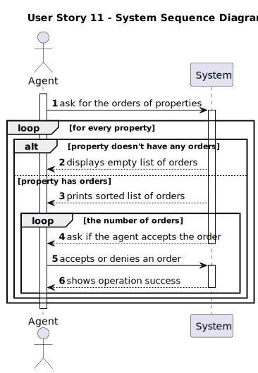

# US 011 - Accept Offers

## 1. Requirements Engineering

### 1.1. User Story Description

 * As an agent, I want to list real estate purchase orders to accept or decline a
purchase order for a property. After accepting or declining, an email notification
should be sent to the customer.

### 1.2. Customer Specifications and Clarifications

**From the specifications document:**

>	 After being appreciated by the agent, he accepts or rejects the order. If the request is accepted, the offer will not be shown again to clients using the application.

**From the client clarifications:**

> **Question**: Does grouping purchase orders by property mean that only properties are displayed, and only after a property is selected are its requests shown? Or are all the requests shown but requests of the same property are shown together?
> 
> **Answer**: The system should show (to the agent) a list of properties that have purchase orders. For each property the system should show a list of purchase orders. Typically we have a small number of purchase orders and we want all orders shown (by property) without selecting a property in particular.

> **Question**: The notification should be sent to the client, but we need to consider this client the client or the potential buyer?
>
> **Answer**: The client is the registered user that placed the order (in US10).

> **Question**: Assuming the previous answer is the potential buyer, should the client be informed about the sale success?
>
> **Answer**: The client will be contacted by means of a phone call. This is not a feature of the system.

### 1.3. Acceptance Criteria

* **AC1:** The list of purchase orders should be grouped by property. The properties
should be sorted from the oldest to the most recent one. For each property, the
list of purchase orders should be sorted by the amount offered, the highest offer
must appear first.

* **AC2:** For each offer, the agent must be able to accept or decline it. The action of
accepting or declining an offer should trigger an email notification to the client.

* **AC3:** When a purchase order is accepted, all the other orders should be declined,
and a message sent to the client.

* **AC4:** If a property does not contain any offers, the system should show an empty
list of offers.

### 1.4. Found out Dependencies

* In order to list offers, the offers must be made by the client(s) (Done in US10)

### 1.5 Input and Output Data

**Input Data:**
 * Selected Data:
    * Option to list offers
    * Accept/Deny offer (one at a time)

**Output Data:**

* List of the purchase orders (if it's not empty).
* Success/Failure of the operation

### 1.6. System Sequence Diagram (SSD)

### 1.7 Other Relevant Remarks

n/a