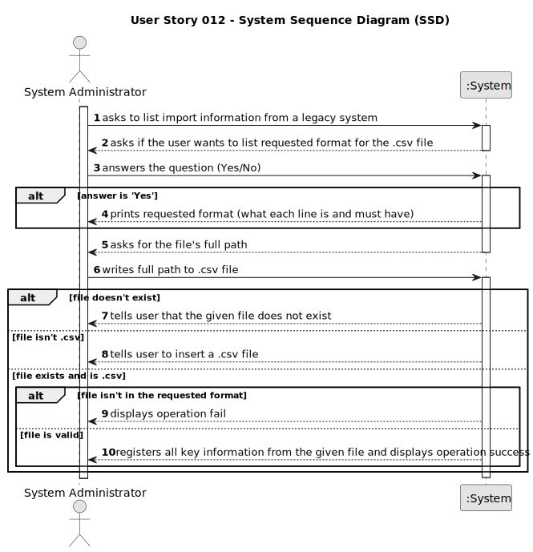

# US012 - Import a Legacy File

## 1. Requirements Engineering

### 1.1. User Story Description

As a system administrator, I want to import information from a legacy
system that has been in use in several agencies.

### 1.2. Customer Specifications and Clarifications

**From the specifications document:**

> *insert specification from general document*

**From the client clarifications:**

> **Question**: In the legacy File provided, on the Location, I assume that the structure of the cell is: Address, City, State, and postal code. Assuming that this is the right structure, shouldn't the districts of the cities be there as well?
> 
> **Answer**: Please check carefully the legacy file. For instance, in line 5 we get "71 ST. NICHOLAS DRIVE, NORTH POLE, FAIRBANKS NORTH STAR,  AK, 99705". When loading the data, you should consider location addresses with and without district info.

> **Question**: From the provided CSV file, our team infers that this feature is meant to import data related to announcements only and not other data like, for example, employee information. Is this correct?
>
> **Answer**: The new system should allow the System Administrator to import CSV files like the one provided in moodle. The legacy system is not able to export any other fields/attributes or formats.

> **Question**: The new system should allow the System Administrator to import CSV files like the one provided in moodle. The legacy system is not able to export any other fields/attributes or formats.
>
> **Answer**: The System Administrator should be able to load any file with the extension csv. The file content must be validated, showing a message to the system administrator if the file is empty or its content is not in the requested format.

> **Question**: Can the System Administrator, when wanting to import information from a legacy system, send more than one file at once?
> 
> **Answer**: Only one file at a time.

### 1.3. Acceptance Criteria

* **AC1:** The system administrator must be able to choose a file to import.
* **AC2:** The system should only accept CSV files.
* **AC3:** The file content must be validated, showing a message to the system administrator if the file is empty or its content is not in the requested format.
* **AC4:** The import operation, when successful, should trigger a success message to the system administrator.

### 1.4. Found out Dependencies

n/a

### 1.5 Input and Output Data

**Input Data:**

* Selected data:
  * Option to print requested file format or not.
* Typed data:
  * Full path to .csv file.

**Output Data:**

* Operation (Un)success

### 1.6. System Sequence Diagram (SSD)

### 1.7 Other Relevant Remarks

n/a