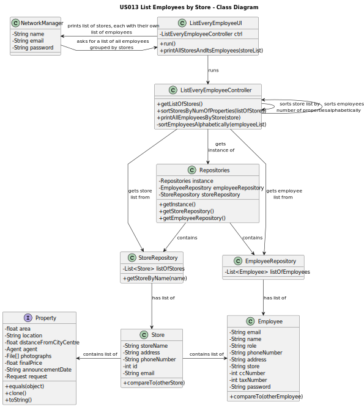

# US013 - List Employees by Store

## 3. Design - User Story Realization

### 3.1. Rationale

**The rationale grounds on the SSD interactions and the identified input/output data.**

| Interaction ID | Question: Which class is responsible for...                                                                                              | Answer                      | Justification (with patterns)                                                                                          |
|:---------------|:-----------------------------------------------------------------------------------------------------------------------------------------|:----------------------------|:-----------------------------------------------------------------------------------------------------------------------|
| Step 1  		     | ...asking to list employees by store?                                                                                                    | NetworkManager              | The Network Manager is the one requesting to list all employees.                                                       |
| 		             | ...interacting with the user and creating a controller?                                                                                  | ListEveryEmployeeUI         | The UI will be the bridge between the user and the controller.                                                         |
|                | ...getting an instance of Repositories?                                                                                                  | ListEveryEmployeeController | The Controller is the bridge between the UI and the repositories.                                                      |
| 		             | ...giving a copy of storeRepository to the Controller?							                                                                            | Repositories                | Repositories stores information about all kinds of repositories.                                                       |
| 		             | ...giving a copy of the store list to the Controller?							                                                                             | StoreRepository             | The StoreRepository stores a list of all stores on the system (and their details).                                     |
| 		             | ...sorting the store list?							                                                                                                        | ListEveryEmployeeController | The Controller is responsible for sorting the stores from the one with the most property listing to the one with less. |
|                | ...getting an instance of Repositories?                                                                                                  | ListEveryEmployeeController | The Controller is the bridge between the UI and the repositories.                                                      |
| 		             | ...giving a copy of employeeRepository to the Controller?							                                                                         | Repositories                | Repositories stores information about all kinds of repositories.                                                       |
| 		             | ...giving a copy of the employee list (from each store) to the Controller?							                                                        | EmployeeRepository          | The EmployeeRepository stores a list of all employee on the system (and their details, like what store they work for). |
| Step 2  		     | ...warning the user that the list is empty (if it's empty)?							                                                                       | ListEveryEmployeeUI         | The UI is responsible for giving vital information to the user.                                                        |
| 		             | ...sorting the employees (grouped by store) alphabetically?							                                                                       | ListEveryEmployeeController | The Controller is the bridge between the UI and the rest of the software.                                              |
| Step 3  		     | ...showing the list of all stores (sorted by number of properties) each with their own list of employees (sorted alphabetically)?							 | ListEveryEmployeeUI         | The UI is responsible for giving vital information to the user.                                                        |

### Systematization ##

According to the taken rationale, the conceptual classes promoted to software classes are:

* NetworkManager
* Employee
* Store
* Property

Other software classes (i.e. Pure Fabrication) identified:
* ListEveryEmployeeUI
* ListEveryEmployeeController

## 3.2. Sequence Diagram (SD)

## 3.3. Class Diagram (CD)

