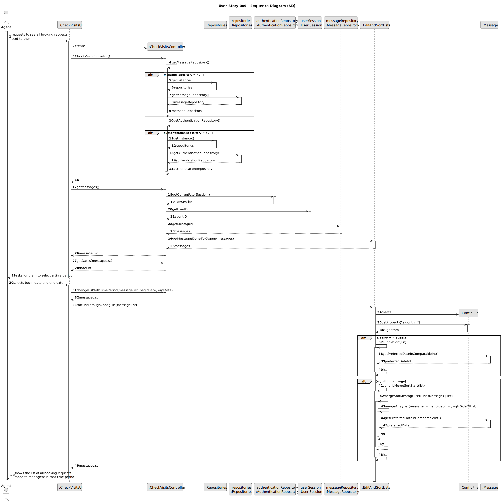
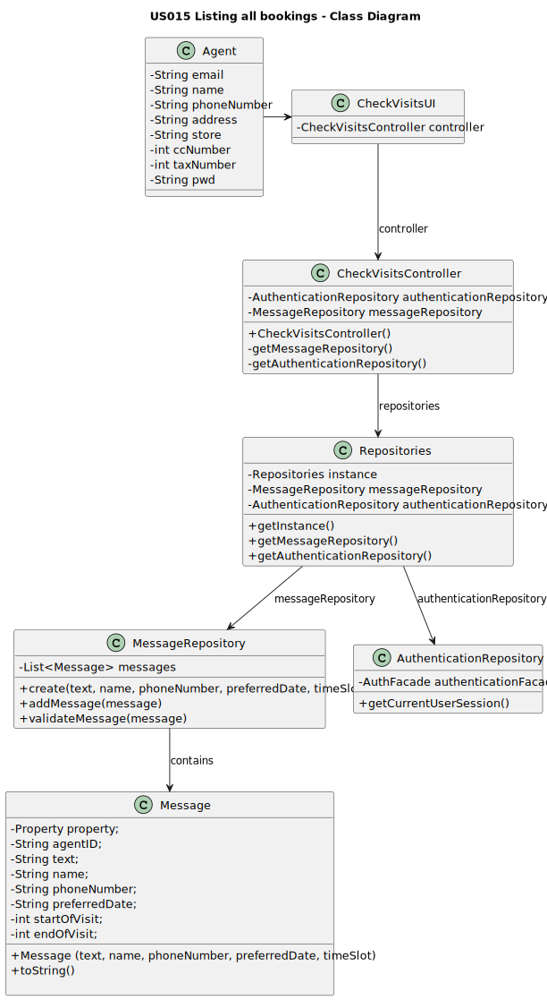

# US015 - Listing all bookings
## 3. Design - User Story Realization

### 3.1. Rationale

**The rationale grounds on the SSD interactions and the identified input/output data.**

| Interaction ID | Question: Which class is responsible for...                                         | Answer                | Justification (with patterns)                                                                                                     |
|:---------------|:------------------------------------------------------------------------------------|:----------------------|:----------------------------------------------------------------------------------------------------------------------------------|
| Step 1         | ...requesting to see all booking requests sent to them?                             | Agent                 | The agent is the actor.                                                                                                           |
|                | ...creating the controller?                                                         | CheckVisitsUI         | The UI connects the user to the controller.                                                                                       |
|                | ...getting an instance of Repositories?                                             | CheckVisitsController | The Controller connects the UI and the repositories.                                                                              |
|                | ...getting a copy of messageRepository to the Controller?                           | Repositories          | Repositories stores information about all kinds of repositories.                                                                  |
|                | ...getting an instance of Repositories?                                             | CheckVisitsController | The Controller connects the UI and the repositories.                                                                              |
|                | ...getting a copy of authenticationRepository to the Controller?                    | Repositories          | Repositories stores information about all kinds of repositories.                                                                  |
|                | ...getting a copy of the current message list?                                      | MessageRepository     | The MessageRepository contains all the Messages saved in the system.                                                              |
|                | ...getting that copy to the UI?                                                     | CheckVisitsController | The Controller connects the UI and the repositories.                                                                              |
|                | ...making a list of dates from the message list to the UI?                          | CheckVisitsController | The Controller is responsible for controlling and using data.                                                                     |
| Step 2         | ...asking them to select a time period?                                             | CheckVisitsUI         | The UI is responsible for communicating with the user.                                                                            |
| Step 3         | ...selecting a time period?                                                         | Agent                 | The agent is the actor.                                                                                                           |
|                | ...changing the message list according to that time period?                         | CheckVisitsController | The Controller is responsible for controlling and using data.                                                                     |
|                | ...sorting the message list?                                                        | EditAndSortLists      | The class EditAndSortLists was made to sort lists, storing methods related to that functionality for the purpose of re-usability. |
| Step 4         | ...showing the list of all booking requests made to that agent in that time period? | CheckVisitsUI         | The UI is responsible for communicating with the user.                                                                            |

### Systematization ##

According to the taken rationale, the conceptual classes promoted to software classes are:

* Agent
* Message

Other software classes (i.e. Pure Fabrication) identified:
* CheckVisitsUI
* CheckVisitsController
* MessageRepository
* AuthenticationRepository
* Repositories

## 3.2. Sequence Diagram (SD)

## 3.3. Class Diagram (CD)

