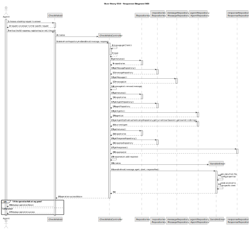
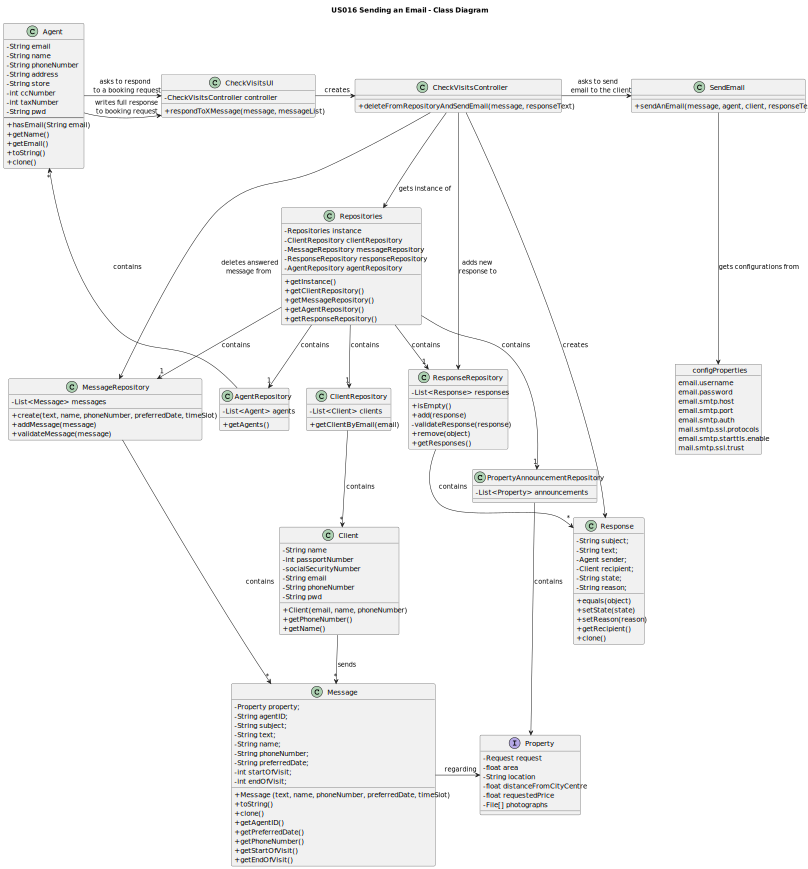

# US016 - Sending an Email Response
## 3. Design - User Story Realization

### 3.1. Rationale

**The rationale grounds on the SSD interactions and the identified input/output data.**

| Interaction ID | Question: Which class is responsible for...                               | Answer                | Justification (with patterns)                                                                                    |
|:---------------|:--------------------------------------------------------------------------|:----------------------|:-----------------------------------------------------------------------------------------------------------------|
| Step 1         | ...choosing a booking request to answer?                                  | Agent                 | The agent is responsible for registering a booking visit after it was requested by a client.                     |
| Step 2         | ...requesting an answer from the agent?                                   | CheckVisitsUI         | Just like in US15, this UI is responsible for interacting with the agent and helping them with booking requests. |
| Step 3         | ...writing a full response to the request?                                | Agent                 | The agent is responsible for registering a booking visit after it was requested by a client.                     |
|                | ...creating a Controller?                                                 | CheckVisitsUI         | The UI is responsible for creating and managing its respective Controller.                                       |
|                | ...getting an instance of Repositories?                                   | CheckVisitsController | The Controller is responsible for getting repositories.                                                          |
|                | ...getting the agent repository?                                          | Repositories          | The 'Repositories' class is responsible for storing every type of repository.                                    |
|                | ...getting the message repository?                                        | Repositories          | The 'Repositories' class is responsible for storing every type of repository.                                    |
|                | ...deleting the answered message from that repository?                    | CheckVisitsController | The Controller is responsible for getting repositories.                                                          |
|                | ...getting the response repository?                                       | Repositories          | The 'Repositories' class is responsible for storing every type of repository.                                    |
|                | ...adding the answered message to the response repository?                | CheckVisitsController | The Controller is responsible for getting repositories.                                                          |
|                | ...getting the configurations from the file 'config.properties'?          | SendAnEmail           | This class is designed to send email to a specified email by a 'no reply' account.                               |
|                | ...sending the email with the entire information to the specified client? | SendAnEmail           | This class is designed to send email to a specified email by a 'no reply' account.                               |
| Step 4         | ...sending a failure message if the operation was unsuccessful?           | CheckVisitsUI         | The UI is responsible for delivering key information to the user.                                                |
| Step 5         | ...sending a success message if the operation was successful?             | CheckVisitsUI         | The UI is responsible for delivering key information to the user.                                                |

### Systematization ##

According to the taken rationale, the conceptual classes promoted to software classes are:

* Agent
* Client
* Message
* Response

Other software classes (i.e. Pure Fabrication) identified:
* CheckVisitsUI
* CheckVisitsController

## 3.2. Sequence Diagram (SD)

## 3.3. Class Diagram (CD)

