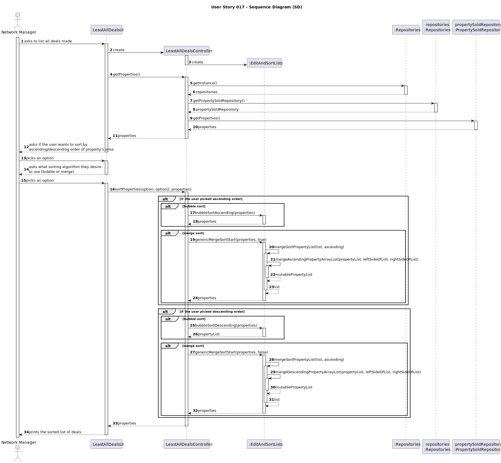
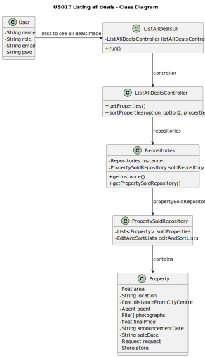

# US017 - Listing All Deals
## 3. Design - User Story Realization

### 3.1. Rationale

**The rationale grounds on the SSD interactions and the identified input/output data.**

| Interaction ID | Question: Which class is responsible for...                                             | Answer                 | Justification (with patterns)                                                                                                       |
|:---------------|:----------------------------------------------------------------------------------------|:-----------------------|:------------------------------------------------------------------------------------------------------------------------------------|
| Step 1         | ...asking to list all deals made?                                                       | User(Network Manager)  | The Network manager does not have a dedicated class. Being a network manager is being a user with that role. The User is the actor. |
|                | ...creating the controller?                                                             | ListAllDealsUI         | The UI connects the user to the controller.                                                                                         |
|                | ...getting an instance of Repositories?                                                 | ListAllDealsController | The Controller connects the UI and the repositories.                                                                                |
|                | ...getting a copy of PropertySoldRepository to the Controller?                          | Repositories           | Repositories stores information about all kinds of repositories.                                                                    |
|                | ...getting a copy of the current sold properties list?                                  | PropertySoldRepository | The PropertySoldRepository contains all the sold properties saved in the system.                                                    |
|                | ...getting that copy to the UI?                                                         | ListAllDealsController | The Controller connects the UI and the repositories.                                                                                |
| Step 2         | ...asking if the user wants to sort by ascending/descending order of a property's area? | ListAllDealsUI         | The UI is responsible for communicating with the user.                                                                              |
| Step 3         | ...picking an option?                                                                   | User                   | The User is the actor.                                                                                                              |
| Step 4         | ...asking what sorting algorithm they want to use (bubble or merge)?                    | ListAllDealsUI         | The UI is responsible for communicating with the user.                                                                              |
| Step 5         | ...picking an option?                                                                   | User                   | The User is the actor.                                                                                                              |
|                | ...calling the EditAndSortList methods to sort the list?                                | ListAllDealsController | The Controller is responsible for controlling and using data.                                                                       |
|                | ...sorting the property list?                                                           | EditAndSortLists       | The class EditAndSortLists was made to sort lists, storing methods related to that functionality for the purpose of re-usability.   |
| Step 6         | ...printing the sorted list of deals?                                                   | ListAllDealsUI         | The UI is responsible for communicating with the user.                                                                              |

### Systematization ##

According to the taken rationale, the conceptual classes promoted to software classes are:

* User
* Property

Other software classes (i.e. Pure Fabrication) identified:
* ListAllDealsUI
* ListAllDealsController
* PropertySoldRepository
* Repositories

## 3.2. Sequence Diagram (SD)

## 3.3. Class Diagram (CD)

