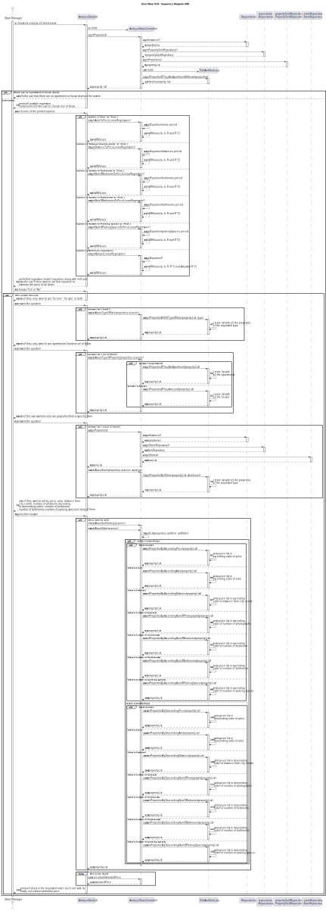
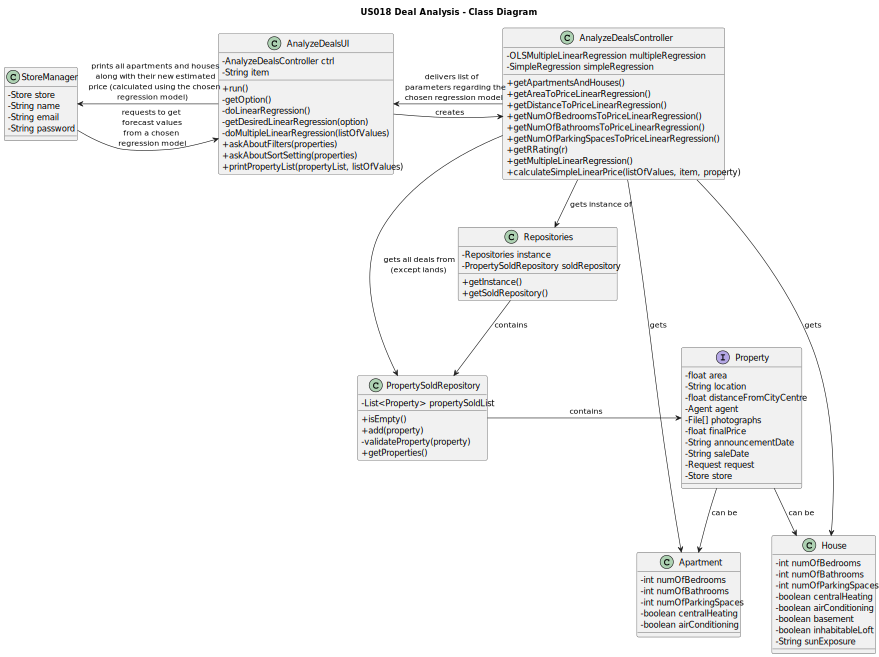

# US018 - Deal Analysis

## 3. Design - User Story Realization

### 3.1. Rationale

**The rationale grounds on the SSD interactions and the identified input/output data.**

| Interaction ID | Question: Which class is responsible for...                                                                                           | Answer                         | Justification (with patterns)                                                                                          |
|:---------------|:--------------------------------------------------------------------------------------------------------------------------------------|:-------------------------------|:-----------------------------------------------------------------------------------------------------------------------|
| Step 1  		     | ...asking to analyze all deals made?                                                                                                  | StoreManager                   | IE: wants to study all deals.                                                                                          |
|                | ...getting an instance of Repositories?                                                                                               | AnalyzeDealsController         | Controller                                                                                                             |
| 		             | ...giving a copy of propertySoldRepository to the Controller?	 						                                                                 | Repositories                   | Repositories stores information about all kinds of repositories.                                                       |
| 		             | ...giving a copy of the property list to the Controller?				 			                                                                      | PropertyAnnouncementRepository | The PropertyAnnouncementRepository stores a list of all properties on the system (and their requests).                 |
| Step 2  		     | ...telling the user that there are no apartment or house deals in the system (if that's the case) (finishes the program)?             | AnalyzeDealsUI                 | Pure Fabrication: there is no reason to assign this responsibility to any existing class in the Domain Model.          |
| Step 3  		     | ...printing all possible regression models?                                                                                           | AnalyzeDealsUI                 | IE: is responsible for user interactions.                                                                              |
| Step 4  		     | ...picking an option?                                                                                                                 | StoreManager                   | IE: knows what regression model they want.                                                                             |
| 		             | ...calculating the list of parameters according to the chosen regression model?				 			                                               | PropertyAnnouncementRepository | The Controller is responsible for performing necessary operations                                                      |
| Step 5  		     | ...printing the property price equation and other values from the chosen regression model, asking if the user wants to use this data? | AnalyzeDealsUI                 | IE: is responsible for user interactions.                                                                              |
| Step 6  		     | ...answering the given question?                                                                                                      | StoreManager                   | IE: knows if they want to use such data.                                                                               |
| Step 7  		     | ...asking the user what type of request they want to see?                                                                             | AnalyzeDealsUI                 | IE: is responsible for user interactions.                                                                              |
| Step 8  		     | ...answering the given question?                                                                                                      | StoreManager                   | IE: knows if they only want to see estimated prices for 'for rent', only for 'for sale', or for both types of request. |
| 		             | ...calling the method that will filter what the user wanted?		 					                                                                  | ListPropertiesController       | The Controller is the bridge between the UI and the rest of the software.                                              |
| 		             | ...filtering the property list with the user's request?		 					                                                                       | EdistAndSortLists              | EditAndSortLists will change a given list, filtering its items.                                                        |
| Step 9  		     | ...asking the user what type of property they want to see?                                                                            | AnalyzeDealsUI                 | IE: is responsible for user interactions.                                                                              |
| Step 10 		     | ...answering the given question?                                                                                                      | StoreManager                   | IE: knows if they only want to see estimated prices for apartments, houses, or for both types of property.             |
| 		             | ...calling the method that will filter what the user wanted?							                                                                   | ListPropertiesController       | The Controller is the bridge between the UI and the rest of the software.                                              |
| 		             | ...filtering the property list with the user's request?							                                                                        | EdistAndSortLists              | EditAndSortLists will change a given list, filtering its items.                                                        |
| Step 11 		     | ...asking the user what store they want to see properties from?                                                                       | AnalyzeDealsUI                 | IE: is responsible for user interactions.                                                                              |
| Step 12 		     | ...answering the given question?                                                                                                      | StoreManager                   | IE: knows what store they want to see the estimated prices.                                                            |
| 		             | ...calling the method that will filter what the user wanted?							                                                                   | ListPropertiesController       | The Controller is the bridge between the UI and the rest of the software.                                              |
| 		             | ...filtering the property list with the user's request?							                                                                        | EdistAndSortLists              | EditAndSortLists will change a given list, filtering its items.                                                        |
| Step 13 		     | ...asking the user what sorting criteria they want to use?                                                                            | AnalyzeDealsUI                 | IE: is responsible for user interactions.                                                                              |
| Step 14 		     | ...answering the given question?                                                                                                      | StoreManager                   | IE: knows what order they want to see properties in.                                                                   |
| 		             | ...calling the method that will sort the list as the user wanted?							                                                              | ListPropertiesController       | The Controller is the bridge between the UI and the rest of the software.                                              |
| 		             | ...sorting the property list with the user's request?							                                                                          | EdistAndSortLists              | EditAndSortLists will change a given list, sorting its items.                                                          |
| Step 15 		     | ...telling the user that there are no apartment or house deals in the system (if that's the case)?                                    | AnalyzeDealsUI                 | IE: is responsible for user interactions.                                                                              |

### Systematization ##

According to the taken rationale, the conceptual classes promoted to software classes are:

* Store Manager
* Property
* Apartment
* House

Other software classes (i.e. Pure Fabrication) identified:
* AnalyzeDealsUI
* AnalyzeDealsController
* PropertySoldRepository

## 3.2. Sequence Diagram (SD)

## 3.3. Class Diagram (CD)

