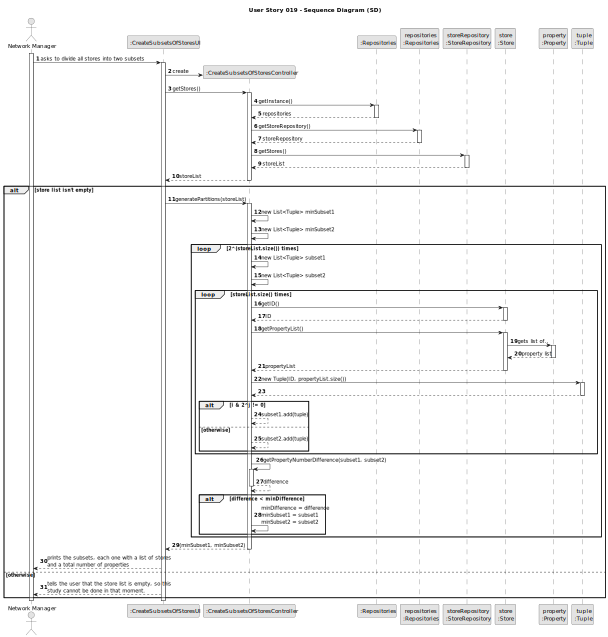
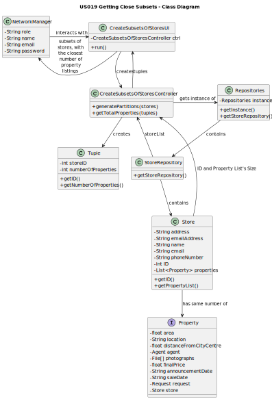

# US019 - Getting Close Subsets

## 3. Design - User Story Realization

### 3.1. Rationale

**The rationale grounds on the SSD interactions and the identified input/output data.**

| Interaction ID | Question: Which class is responsible for...                                                                        | Answer                          | Justification (with patterns)                                                                                 |
|:---------------|:-------------------------------------------------------------------------------------------------------------------|:--------------------------------|:--------------------------------------------------------------------------------------------------------------|
| Step 1  		     | ...asking to get subsets of properties?                                                                            | NetworkManager                  | IE: wants to analyze stores.                                                                                  |
| 		             | ...creating a Controller?                                                                                          | CreateSubsetsOfStoresUI         | Pure Fabrication: there is no reason to assign this responsibility to any existing class in the Domain Model. |
|                | ...getting an instance of Repositories?                                                                            | CreateSubsetsOfStoresController | Controller                                                                                                    |
| 		             | ...giving a copy of propertySoldRepository to the Controller?	 				  		                                            | Repositories                    | Repositories stores information about all kinds of repositories.                                              |
| 		             | ...giving a copy of the store list to the Controller?				 			                                                      | StoreRepository                 | The StoreRepository stores a list of all stores on the system.                                                |
| 		             | ...calculating the possible partitions and returning the one with the closest number of property listings?				 			 | CreateSubsetsOfStoresController | The Controller is responsible for processing data.                                                            |
| 		             | ...storing their own properties?				 			                                                                           | Store                           | A Store has its own list of Properties.                                                                       |
| 		             | ...storing the store ID and property list size for each store in the partitions?				 			                           | Tuple                           | This object is responsible for storing these items, in order to reduce processing time.                       |
| Step 2  		     | ...printing the two subsets and their details?                                                                     | CreateSubsetsOfStoresUI         | Pure Fabrication: there is no reason to assign this responsibility to any existing class in the Domain Model. |
| Step 3  		     | ...warning the user that there aren't any stores currently in the system (if that's the case)?                     | CreateSubsetsOfStoresUI         | The UI is responsible for delivering important information to the user.                                       |

### Systematization ##

According to the taken rationale, the conceptual classes promoted to software classes are:

* NetworkManager
* Store
* Property

Other software classes (i.e. Pure Fabrication) identified:
* CreateSubsetsOfStoresUI
* CreateSubsetsOfStoresController
* StoreRepository

## 3.2. Sequence Diagram (SD)

## 3.3. Class Diagram (CD)

