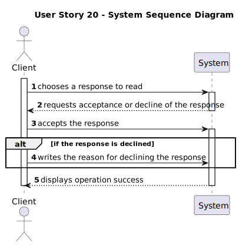

# US 020 - Read a Response

## 1. Requirements Engineering

### 1.1. User Story Description

As a client, I want to read the response for the appointment request, to
accept or reject it.

### 1.2. Customer Specifications and Clarifications

**From the specifications document:**

> After consulting a list of responses, the client can request to read a response. 
>  The agent receives the request and asks the client to accept or decline it. If declined, the agent requests a reason.

**From the client clarifications:**

### 1.3. Acceptance Criteria

* **AC1:** The agent must be notified when the message is displayed to the client.
* **AC2:** The appointment request must provide information about the property and
  the date of the appointment.
* **AC3:** When the appointment is rejected, the client must specify the reason.
* **AC4:** The appointment request must provide the agent name and phone number.

### 1.4. Found out Dependencies

* There is a dependency to "US016 Sending an Email Response" since this US is responsible to create the response.

### 1.5 Input and Output Data

**Input Data:**

* Selected data:
  * the number of the responses he wants to read

* Typed data:
  * response in case he declines the response

**Output Data:**

* (In)Success of the operation

### 1.6. System Sequence Diagram (SSD)

### 1.7 Other Relevant Remarks

* n/a