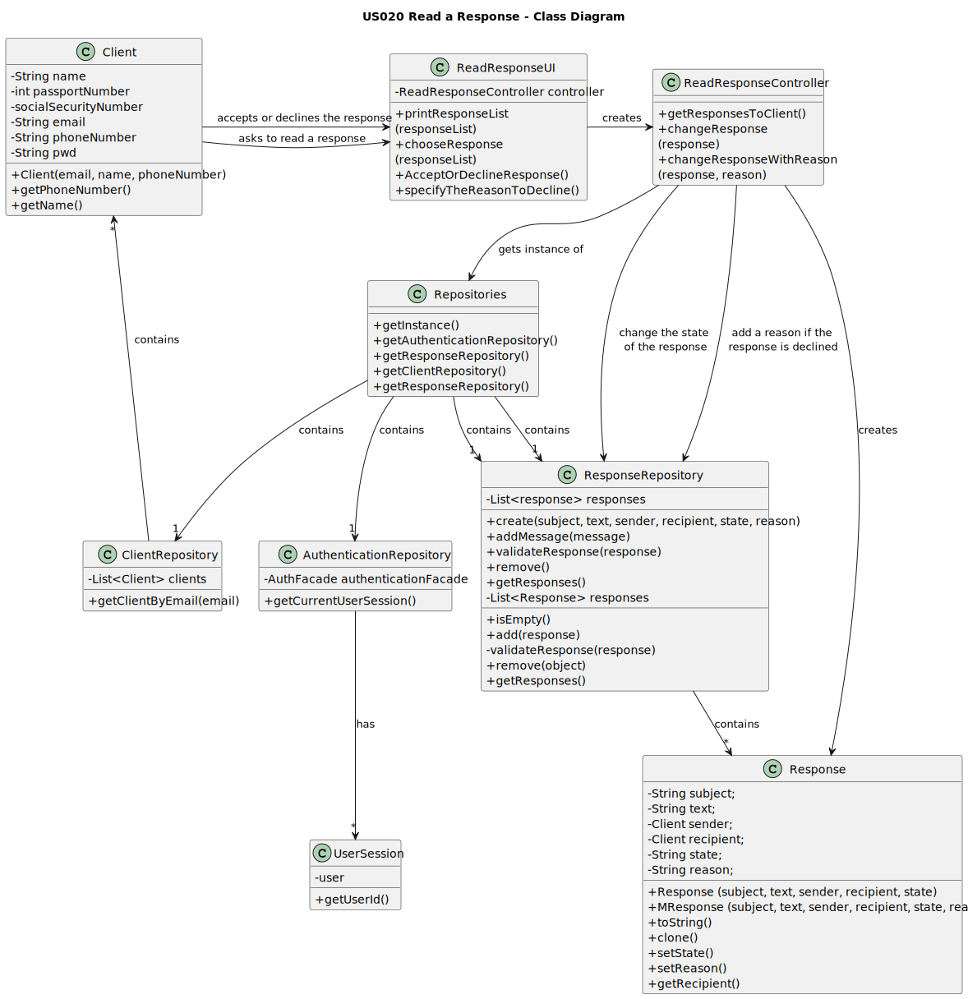

# US015 - Read a Response
## 3. Design - User Story Realization

### 3.1. Rationale

**The rationale grounds on the SSD interactions and the identified input/output data.**

| Interaction ID | Question: Which class is responsible for...                                                     | Answer                 | Justification (with patterns)                                                                                                     |
|:---------------|:------------------------------------------------------------------------------------------------|:-----------------------|:----------------------------------------------------------------------------------------------------------------------------------|
| Step 1         | ...requesting to read all responses?                                                            | Client                 | The client is the actor.                                                                                                          |
|                | ...creating the controller?                                                                     | ReadResponseUI         | The UI connects the user to the controller.                                                                                       |
|                | ...getting an instance of Repositories?                                                         | ReadResponseController | The Controller connects the UI and the repositories.                                                                              |
|                | ...getting a copy of responsesRepository to the Controller?                                     | Repositories           | Repositories stores information about all kinds of repositories.                                                                  |
|                | ...getting a copy of authenticationRepository to the Controller?                                | Repositories           | Repositories stores information about all kinds of repositories.                                                                  |
|                | ...getting a copy of the current response list?                                                 | ResponseRepository     | The ResponseRepository contains all the Responses saved in the system.                                                            |
|                | ...getting that copy to the UI?                                                                 | ReadResponseController | The Controller connects the UI and the repositories.                                                                              |
| Step 2         | ...asking them to accept or decline the response?                                               | ReadResponseUI         | The UI is responsible for communicating with the user.                                                                            |
| Step 3         | ...accepting or declining the response?                                                         | Client                 | The client is the actor.                                                                                                          |
|                | ...changing the response list according to the user's answer?                                   | ReadResponseController | The Controller is responsible for controlling and using data.                                                                     |
| Step 4         | ...asking them to write a reason to decline the response? (if the client declined the response) | ReadResponseUI         | The UI is responsible for communicating with the user.                                                                            |
|                | ...write a reason to decline the response?                                                      | Client                 | The client is the actor.                                                                                                          |
|                | ...changing the response list according to user's answer and reason?                            | ReadResponseController | The Controller is responsible for controlling and using data.                                                                     |
| Step 5         | ...displays the operation was a success?                                                        | ReadResponseUI         | The UI is responsible for communicating with the user.                                                                            |

### Systematization ##

According to the taken rationale, the conceptual classes promoted to software classes are:

* Client
* Response

Other software classes (i.e. Pure Fabrication) identified:
* ReadResponseUI
* ReadResponseController
* Repositories
* ResponseRepository

## 3.2. Sequence Diagram (SD)

## 3.3. Class Diagram (CD)

